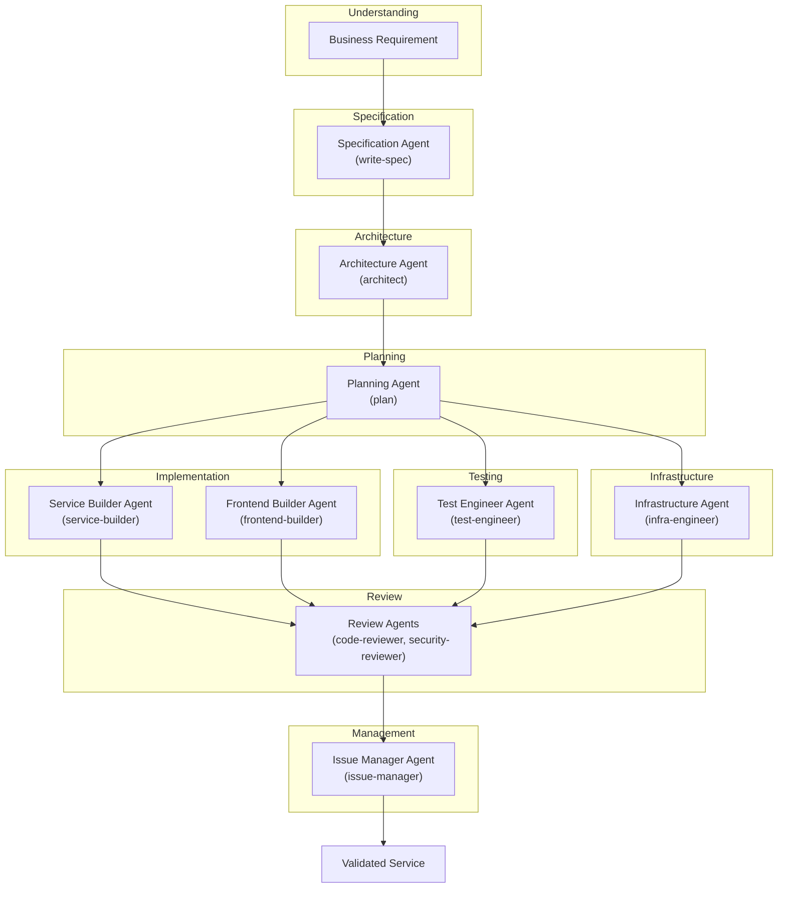
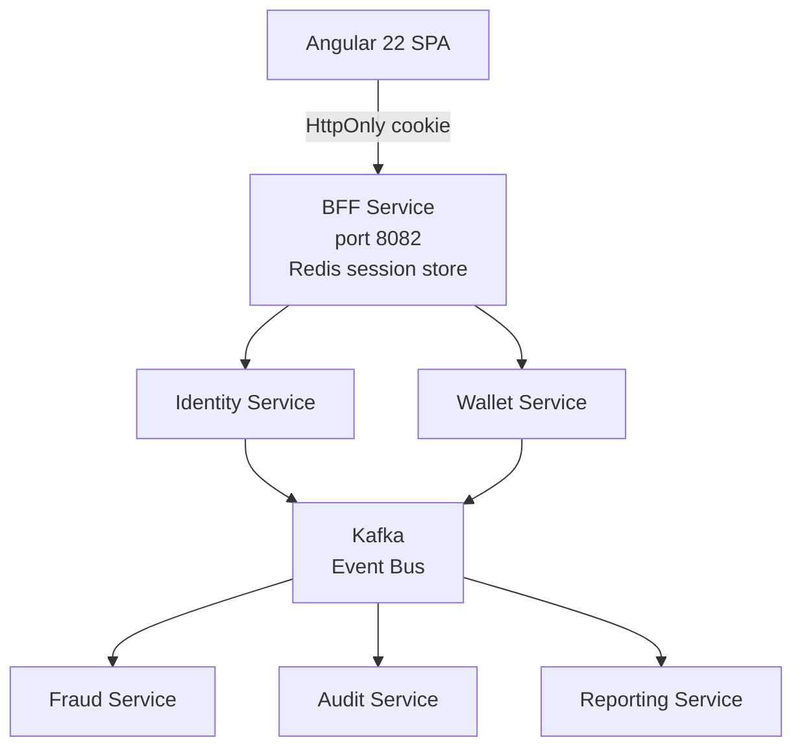
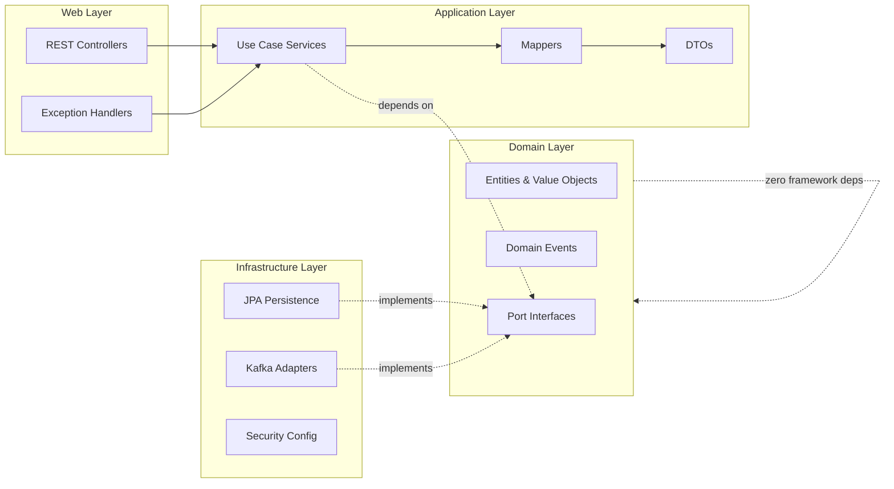

<picture>
  <source media="(prefers-color-scheme: dark)" srcset="https://img.shields.io/badge/Reference%20Architecture-00C853?style=for-the-badge&labelColor=1a1a2e">
  
</picture>
<picture>
  <source media="(prefers-color-scheme: dark)" srcset="https://img.shields.io/badge/AI%20Assisted%20Engineering-7C3AED?style=for-the-badge&labelColor=1a1a2e">
  
</picture>
<picture>
  <source media="(prefers-color-scheme: dark)" srcset="https://img.shields.io/badge/Spec%20Driven-0288D1?style=for-the-badge&labelColor=1a1a2e">
  
</picture>
<picture>
  <source media="(prefers-color-scheme: dark)" srcset="https://img.shields.io/badge/Java%2021-ED8B00?style=for-the-badge&logo=openjdk&logoColor=white&labelColor=1a1a2e">
  
</picture>
<picture>
  <source media="(prefers-color-scheme: dark)" srcset="https://img.shields.io/badge/Spring%20Boot%203-6DB33F?style=for-the-badge&logo=springboot&logoColor=white&labelColor=1a1a2e">
  
</picture>
<picture>
  <source media="(prefers-color-scheme: dark)" srcset="https://img.shields.io/badge/Angular%2022-DD0031?style=for-the-badge&logo=angular&logoColor=white&labelColor=1a1a2e">
  
</picture>
<picture>
  <source media="(prefers-color-scheme: dark)" srcset="https://img.shields.io/badge/Kafka-231F20?style=for-the-badge&logo=apachekafka&logoColor=white&labelColor=1a1a2e">
  
</picture>

---

# **Aegis** — Digital Payment Platform

> **A financial platform reference architecture built with enterprise engineering practices. Designed, specified, implemented, tested, and documented through an AI-assisted engineering workflow.**

Aegis is a microservices-based digital payment platform that demonstrates production-oriented software engineering: hexagonal architecture, event-driven communication, transactional outbox, containerized deployments, and GitOps-ready CI/CD.

This repository demonstrates **the ability to abstract across languages, frameworks, and architectural paradigms** — focusing on what truly matters: understanding the business domain, translating it into a rigorous specification, and using AI-assisted workflows as a force multiplier to execute. Aegis was designed and implemented through an AI-assisted engineering workflow, retaining human ownership of architecture, validation and technical decisions.

---

## Engineering Evidence

Every claim in this repository is backed by a link. Nothing here is asserted without evidence.

| CI status | Security scanning | License | Coverage |
|-----------|-------------------|---------|----------|
| [](https://github.com/AlexAlvarezGallardo-GitHub/Aegis/actions/workflows/ci.yml) | [](https://github.com/AlexAlvarezGallardo-GitHub/Aegis/actions/workflows/security.yml) | [](LICENSE.md) | [](.github/workflows/coverage.yml) |

| Evidence | Where |
|----------|-------|
| **Canonical service catalog** | [`docs/architecture/service-catalog.md`](docs/architecture/service-catalog.md) |
| **Capability × environment matrix** | [`docs/project-status.md`](docs/project-status.md) |
| CI pipeline (build, unit, integration, coverage) | [`.github/workflows/ci.yml`](.github/workflows/ci.yml) |
| Security pipeline (CodeQL, Trivy, SBOM, Scorecard) | [`.github/workflows/security.yml`](.github/workflows/security.yml) |
| Real GitHub metrics (portfolio dashboard) | [`portfolio/public/data/github-metrics.json`](portfolio/public/data/github-metrics.json) |
| Architecture decisions (ADRs) | [`docs/adr/`](docs/adr/) |
| OpenAPI contracts | `specs/*/contracts/` |
| Domain documentation (vault) | [`docs/obsidian/`](docs/obsidian/) |
| GitOps repository | [Aegis-GitOps](https://github.com/AlexAlvarezGallardo-GitHub/Aegis-GitOps) |

---

## The Vision: AI-Assisted Engineering Workflow

Traditional development is linear: analyst → architect → developer → tester → devops. Each handoff loses context, introduces delay, and costs money.

Aegis was built with a **different model** — an AI-assisted engineering workflow where specialized agents work within defined conventions under human direction:



Each agent is a specialist. Each one has a defined role, skill set, and quality bar. Together they form a **virtual engineering team** that I direct, review, and integrate — while I retain ownership of architecture, validation, and technical decisions.

---

## What This Means in Practice

| Traditional Approach | Aegis Approach | Impact |
|---------------------|----------------|--------|
| Requirements in Jira, lost in translation | Structured spec written from conversation | Living documentation in `specs/` |
| Architect draws diagrams, developers interpret | Architectural rules enforced by automated checks in CI | Compliance is verifiable, not assumed |
| Dev writes code, another reviews, another tests | Specialized AI-assisted workflows with built-in quality gates | Iteration speed with recorded validation |
| Context switching between Java, Angular, K8s, CI/CD | One engineer directs workflows specialized in each domain | Focus on business outcomes, not syntax |
| Documentation is an afterthought | Spec-driven: contracts, schemas, ADRs generated alongside code | Always up-to-date, always consistent |
| Onboarding takes months | Repository IS the documentation — specs, decisions, rationale, all in one place | New contributors become productive quickly |

---

## How I Built This

1. **I understand the business** — Aegis is a digital payment platform. I researched fintech requirements, regulatory concerns, fraud patterns, and scalability needs before writing a single line of code.

2. **I specify before I build** — Every feature starts with a structured specification document: user stories, functional requirements, acceptance criteria, edge cases, domain model, state machine, business rules, and success criteria. See `specs/001-user-registration/spec.md` (508 lines).

3. **I make technical decisions with evidence** — Every technology choice is backed by a `research.md` document comparing alternatives with rationale. BCrypt vs Argon2id? Outbox vs CDC vs Kafka Transactions? UUID v7 vs v4 vs Snowflake? All documented and decided before implementation.

4. **I direct AI-assisted engineering workflows** — I describe what needs to be built, and specialized AI-assisted workflows generate the code. I review, refine, and integrate. My time is spent on architecture, quality, and business value — not on boilerplate. Human ownership of technical decisions is retained throughout.

5. **I deliver verifiable quality** — The Identity Service (the first service) includes domain logic test coverage, integration tests with real PostgreSQL and Kafka via Testcontainers, transactional outbox pattern, Flyway migrations, OpenAPI contract, Kafka event schema, and an Angular frontend with Material Design. Coverage figures and CI results are published and linked from the [evidence index](docs/project-status.md).

---

## Architectural Highlights



### Hexagonal Architecture (Ports & Adapters)

Every service enforces strict inward dependency direction — a design that keeps business logic pure, testable, and framework-agnostic:



- **Domain**: Pure Java 21 — zero framework annotations, zero imports from Spring/JPA. Entities, value objects (records), enums, domain events, and port interfaces. This layer is **completely framework-agnostic**.
- **Application**: Use case implementations, DTOs, mappers. Depends only on domain ports.
- **Infrastructure**: JPA adapters, Kafka producers/consumers, security configuration, outbox scheduler.
- **Web**: REST controllers, `@RestControllerAdvice` exception handlers, request filters.

### Transactional Outbox Pattern

Guaranteed **at-least-once event delivery** without distributed transactions:

1. Aggregate operation + domain event are persisted in a **single ACID transaction**
2. Event is written to an `outbox_events` table alongside domain data
3. `OutboxRelayScheduler` polls unpublished events and forwards to Kafka
4. On Kafka acknowledgment, event status updates to `PUBLISHED`

### Event-Driven Communication

- **Primary channel**: Apache Kafka with `aegis.<service>.<event>` topic naming
- **Well-versioned schemas**: JSON Schema with explicit `schemaVersion`
- **Synchronous calls**: Restricted to the BFF edge service (proxying to Identity and Wallet); an API Gateway with circuit breakers is planned
- **Bounded contexts**: Each service owns its data — no shared databases, no direct access

---

## Technology Stack

| Layer | Technology | Why |
|-------|-----------|-----|
| **Language** | Java 21 | Widely adopted in fintech, records & pattern matching |
| **Backend** | Spring Boot 3.3.5 | Industry standard, massive ecosystem, mature |
| **Persistence** | Spring Data JPA + PostgreSQL 16 | ACID compliance, relational integrity for financial data |
| **DB Migrations** | Flyway 10.21.0 | Version-controlled schema evolution, rollback support |
| **Messaging** | Apache Kafka 7.5.0 | High-throughput, persistent, replayable event backbone |
| **Security** | Spring Security + BCrypt (≥10) | Non-negotiable for financial systems |
| **Session Store** | Redis 7 + Spring Session | Distributed HttpOnly cookie sessions for BFF |
| **API Docs** | OpenAPI 3 (spec-first) | Contract-first, auto-generated, always current |
| **Frontend** | Angular 22 + Material 22, TypeScript 6 | Widely adopted SPA framework, accessible by default |
| **Build** | Maven multi-module + Checkstyle | Reproducible, quality-gated builds |
| **Containerization** | Docker (multi-stage, distroless) | Minimal attack surface, fast deploys |
| **Orchestration** | Kubernetes + Helm | Self-healing, auto-scaling in production |
| **CI/CD** | GitHub Actions | Matrix builds, parallel validations, quality gates |
| **Testing** | JUnit 5, Mockito, Testcontainers 1.20.4 | Real infrastructure in tests, not mocks |

---

## Services

> **Canonical catalog:** [`docs/architecture/service-catalog.md`](docs/architecture/service-catalog.md). Aegis currently contains **6 deployable backend services, 1 frontend application and 1 shared Java library** — this number is the single source of truth.

| Service | Status | Description |
|---------|--------|-------------|
| **Identity Service** `aegis-identity-service` | ✅ **Implemented · Validated** | User registration, authentication, RBAC — full hexagonal stack |
| **BFF Service** `aegis-bff-service` | ✅ **Implemented · Validated** | Backend for Frontend — HttpOnly session cookies, JWT proxy, CSRF protection |
| **Wallet Service** `aegis-wallet-service` | ✅ **Implemented · Validated** | Digital wallets, balance management, deposits |
| **Fraud Service** `aegis-fraud-service` | ✅ **Implemented · Validated** | Real-time fraud assessment, rule engine |
| **Audit Service** `aegis-audit-service` | ✅ **Implemented · Validated** | Immutable audit trail from domain events |
| **Reporting Service** `aegis-reporting-service` | 🟡 **Implemented · Partial** | Event consumers and projections — reporting capabilities incomplete |
| **Common** `aegis-common` | ✅ **Implemented** | UUID v7 generator, shared base exceptions, utilities |
| **Payment Service** | 📋 Planned | Payment processing, reconciliation, 3DS |
| **Notification Service** | 📋 Planned | Email, SMS, push with templating and delivery tracking |
| **API Gateway** | 📋 Planned | API Gateway, rate limiting, circuit breakers (BFF currently fills the edge role) |

> See [`docs/project-status.md`](docs/project-status.md) for the full capability × environment matrix.

## Environments

| Environment | Status |
|-------------|--------|
| **Local** | Functional (docker-compose dev stack) |
| **DEV** | Functional (docker-compose) / Prepared (GitOps structure) |
| **PRE** | Prepared structure |
| **STAGE** | Prepared structure |
| **PROD** | Prepared structure |

> PRE, STAGE and PROD demonstrate the intended promotion structure but are not currently operating production environments. There is no customer traffic, no regulatory certification, no real banking or KYC provider, and no commercial SLA.

---

## Quality & Testing

| Layer | Tools | Standard |
|-------|-------|----------|
| **Unit tests** | JUnit 5 + Mockito | Domain logic covered; per-module coverage reported via JaCoCo |
| **Integration tests** | Testcontainers (real PostgreSQL 16 + Kafka 7.5) | Adapters tested against real infrastructure |
| **End-to-end tests** | Testcontainers + MockMvc | Full HTTP request → database → Kafka flow |
| **Frontend tests** | Jasmine + Karma | Component rendering, service mocking, form validation |

### CI/CD — 4 Parallel Quality Gates

Every pull request triggers automated validation of:

- **Branch naming** — Enforces project conventions
- **Commit messages** — Validates conventional commit format
- **PR title** — Ensures clear, structured descriptions
- **PR body** — Verifies summary, changes, and testing documentation

Plus hooks for **local enforcement** before code ever reaches CI.

---

## Project Structure

```
aegis/
├── backend/
│   ├── aegis-common/                  # Shared utilities
│   │   └── src/main/java/com/aegis/common/
│   ├── aegis-identity-service/        # Full hexagonal service
│   │   └── src/main/java/com/aegis/identity/
│   │       ├── domain/                # Pure Java — zero framework deps
│   │       │   ├── model/             # User, UserId, Email, PasswordHash...
│   │       │   ├── event/             # UserRegistered domain event
│   │       │   ├── exception/         # DuplicateEmail, WeakPassword...
│   │       │   └── port/              # RegisterUserUseCase, UserRepository...
│   │       ├── application/           # Use case implementations
│   │       │   ├── service/           # RegisterUserService
│   │       │   ├── dto/               # RegisterUserCommand, Response
│   │       │   └── mapper/            # UserMapper (domain ↔ DTO)
│   │       ├── infrastructure/        # Adapters for persistence & messaging
│   │       │   ├── persistence/       # JPA entities, repositories, Outbox
│   │       │   ├── messaging/         # KafkaEventPublisher
│   │       │   ├── config/            # KafkaConfig, SecurityConfig
│   │       │   └── security/          # BCryptPasswordHasher
│   │       └── web/                   # REST layer
│   │           ├── controller/        # RegistrationController
│   │           ├── advice/            # RegistrationExceptionHandler
│   │           └── dto/               # RegisterUserRequest
│   └── aegis-bff-service/             # Backend for Frontend
│       └── src/main/java/com/aegis/bff/
│           ├── BffApplication.java    # Spring Boot entry point
│           ├── BffAuthController.java # /api/bff/auth/* endpoints
│           ├── BffService.java        # Proxy logic (RestClient → Identity Service)
│           ├── SessionJwtStore.java   # JWT storage in HttpSession
│           ├── SessionJwtAuthenticationFilter.java # Session-to-JWT filter
│           ├── LoginRequest.java      # Login request DTO
│           └── SecurityConfig.java    # CSRF, HttpOnly cookies, stateless session
├── frontend/
│   └── aegis-frontend/                # Angular 22 SPA
│       ├── Dockerfile                 # Production multi-stage build (nginx)
│       ├── Dockerfile.dev             # Dev image with ng serve --poll
│       ├── nginx.conf                 # Nginx reverse proxy for production
│       ├── proxy.conf.json            # Dev proxy to localhost backends
│       ├── proxy.conf.docker.json     # Dev proxy to Docker service names
│       ├── .dockerignore
│       └── src/app/
│           ├── features/dashboard/    # Dashboard with KPIs and system status
│           ├── features/wallet/       # Wallet management (create, list, search)
│           ├── features/registration/ # Registration form component
│           ├── features/auth/         # Login component (via BFF)
│           ├── shared/layout/
│           │   ├── app-shell/         # Main layout wrapper with sidebar + header
│           │   ├── sidebar/           # Left navigation with grouped sections
│           │   ├── header/            # Top bar with user menu and theme toggle
│           │   └── page-placeholder/  # Generic placeholder for stub routes
│           ├── shared/data-display/   # StatCard, StatusChip, EmptyState, LoadingSkeleton
│           ├── shared/guards/         # AuthGuard with session verification
│           ├── shared/interceptors/   # HTTP auth, error handling with 401 redirect
│           └── shared/models/         # Auth and wallet models
├── infra/
│   ├── docker-compose.yml             # Production: all services with multi-stage builds
│   ├── docker-compose.dev.yml         # Dev overlay: hot-reload with volume mounts
│   ├── build-and-run.bat              # Build & run script (accepts 'dev' argument)
│   └── build-and-run.sh               # Linux equivalent
├── specs/                             # Spec-driven development artifacts
│   ├── 001-user-registration/
│   │   ├── spec.md                    # 508-line full specification
│   │   ├── plan.md                    # 10-phase implementation plan
│   │   ├── research.md                # Technical decisions with rationale
│   │   ├── data-model.md              # Domain & persistence data model
│   │   ├── tasks.md                   # 51 tasks with dependencies
│   │   └── contracts/                 # OpenAPI 3 spec + JSON Schema event
│   │       ├── registration-api.yaml
│   │       └── user-registered-event.json
│   └── 002-user-authentication/       # UC-002 specs (merged)
│       ├── spec.md
│       ├── plan.md
│       ├── data-model.md
│       ├── tasks.md
│       └── contracts/
│           ├── auth-api.yaml
│           ├── user-authenticated-event.json
│           └── user-account-locked-event.json
├── portfolio/                          # Engineering portfolio website (spec 011)
│   └── public/data/github-metrics.json # Real GitHub metrics (workflow-generated)
└── docs/
    ├── design-system/                 # Brand, colors, typography, components
    └── AGENTS-README.md               # AI agent workflow documentation
```

---

## Getting Started

> **First time?** Copy the environment template and generate your own dev secrets before starting anything:
>
> ```bash
> copy infra\.env.example infra\.env   # Windows
> # cp infra/.env.example infra/.env   # Linux/macOS
> ```
>
> `infra/.env` is gitignored — it holds **development-only** credentials (PostgreSQL, JWT). Never commit it or reuse its values outside local dev. For local development the defaults in `.env.example` are fine.

### Option A: Local Development (Docker Compose with hot-reload)

```bash
# Start everything with hot-reload (infrastructure + apps)
infra\build-and-run.bat dev
# or
docker compose -f infra/docker-compose.yml -f infra/docker-compose.dev.yml up -d
```

Changes to any `src/` file are detected automatically:
- **Frontend**: `ng serve --poll 1000` reloads changed files
- **Backend**: `spring-boot-devtools` restarts services on recompilation

### Option B: Manual (separate terminals)

```bash
# 1. Start infrastructure (PostgreSQL, Kafka, ZooKeeper, Redis)
docker compose -f infra/docker-compose.yml up -d

# 2. Build all backend modules
cd backend
mvn clean install -DskipTests

# 3. Start Identity Service (terminal 1)
#    Manual runs need the secrets in your shell (load them from infra/.env):
#    PowerShell:   $env:SPRING_DATASOURCE_PASSWORD="<db-password>"; $env:JWT_SECRET="<32+ chars>"
#    bash:         export SPRING_DATASOURCE_PASSWORD=<db-password> export JWT_SECRET=<32+ chars>
mvn spring-boot:run -pl aegis-identity-service -Dspring-boot.run.profiles=dev

# 4. Start BFF Service (terminal 2)
mvn spring-boot:run -pl aegis-bff-service -Dspring-boot.run.profiles=dev

# 5. Start the Angular frontend (terminal 3)
cd frontend/aegis-frontend
npm install && npm run start

# 6. Run the full test suite (requires Docker — Testcontainers spins up real infra)
cd backend && mvn clean verify
```

### Option C: Production build

```bash
# Build images and start all services (no hot-reload)
infra\build-and-run.bat
# or
docker compose -f infra/docker-compose.yml up -d --build
```

### Access Points

| Component | URL |
|-----------|-----|
| Angular Frontend | http://localhost:4200 |
| BFF Service | http://localhost:8082 |
| Identity Service | http://localhost:8081 |
| Wallet Service | http://localhost:8083 |
| PostgreSQL (Identity) | localhost:5432 |
| PostgreSQL (Wallet) | localhost:5433 |
| Kafka UI | http://localhost:8090 |
| Redis | localhost:6379 |
| Database Admin (DbGate) | http://localhost:3000 |

---

## The Bottom Line

This repository is **not** about Java 21, or Spring Boot, or Angular. It's not about Kafka or hexagonal architecture. Those are just tools.

This is about **how software can be built**: one engineer with business understanding, architectural vision, and the ability to direct specialized AI-assisted workflows can design and deliver a coherent, documented, tested platform.

Aegis is designed and implemented through an **AI-assisted engineering workflow with human ownership** of architecture, validation and technical decisions. Every important claim in this repository is linked to verifiable evidence — see the [project status matrix](docs/project-status.md).

---

<p align="center">
  <sub>Financial platform reference architecture · AI-assisted engineering with human validation · Business-first, technology-second</sub>
</p>
