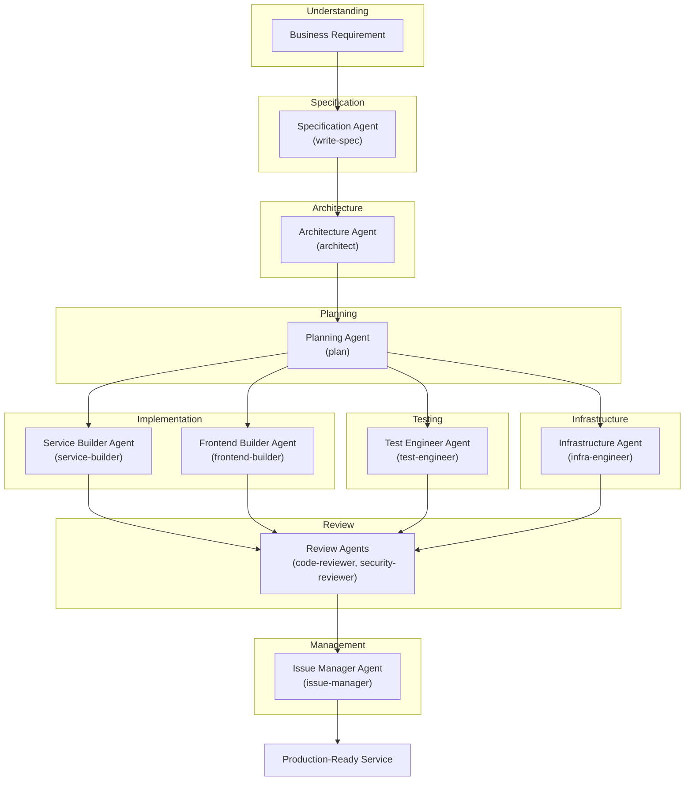
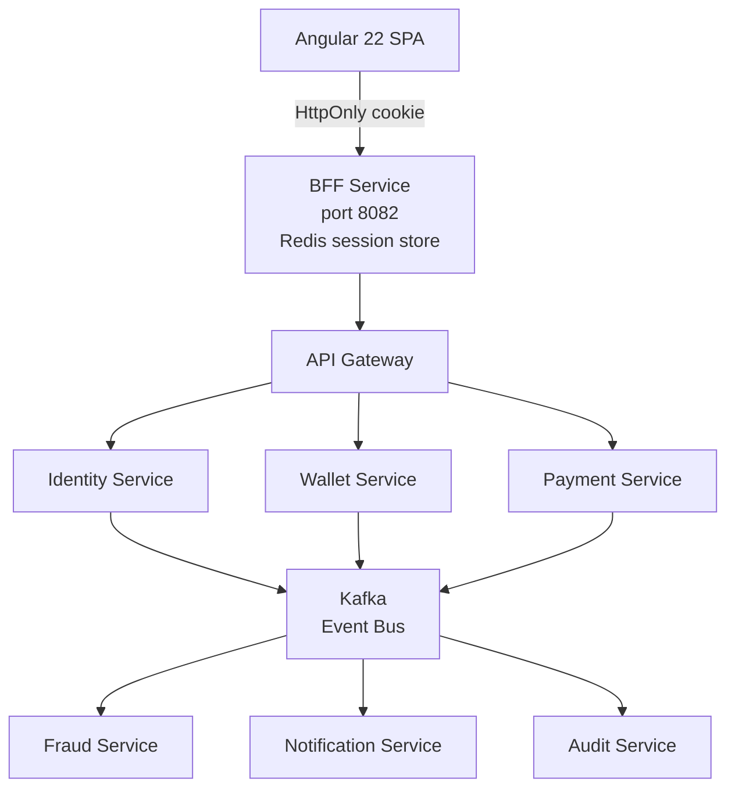
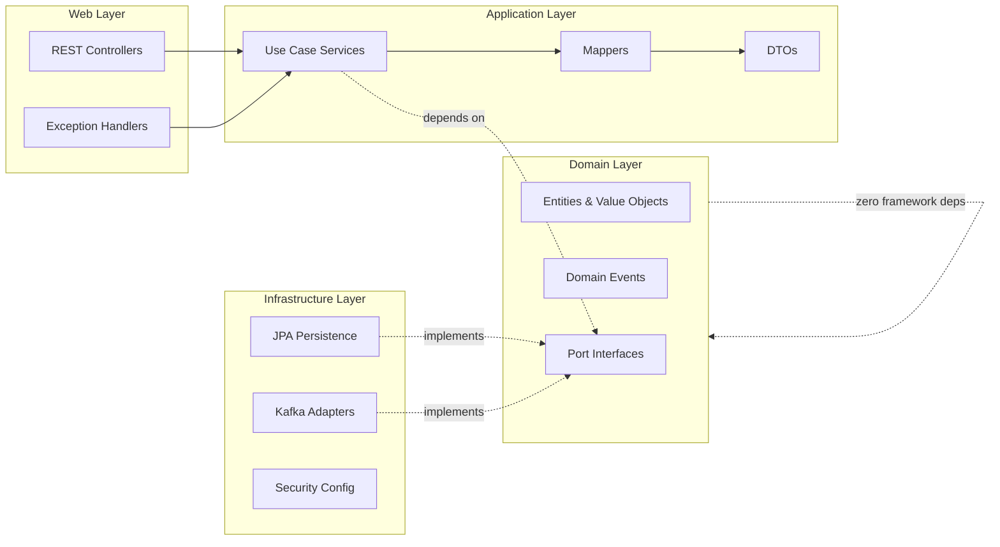

<picture>
  <source media="(prefers-color-scheme: dark)" srcset="https://img.shields.io/badge/Enterprise%20Ready-00C853?style=for-the-badge&labelColor=1a1a2e">
  
</picture>
<picture>
  <source media="(prefers-color-scheme: dark)" srcset="https://img.shields.io/badge/AI%20Agent%20Orchestrated-7C3AED?style=for-the-badge&labelColor=1a1a2e">
  
</picture>
<picture>
  <source media="(prefers-color-scheme: dark)" srcset="https://img.shields.io/badge/Spec%20Driven-0288D1?style=for-the-badge&labelColor=1a1a2e">
  
</picture>
<picture>
  <source media="(prefers-color-scheme: dark)" srcset="https://img.shields.io/badge/Java%2021-ED8B00?style=for-the-badge&logo=openjdk&logoColor=white&labelColor=1a1a2e">
  
</picture>
<picture>
  <source media="(prefers-color-scheme: dark)" srcset="https://img.shields.io/badge/Spring%20Boot%203-6DB33F?style=for-the-badge&logo=springboot&logoColor=white&labelColor=1a1a2e">
  
</picture>
<picture>
  <source media="(prefers-color-scheme: dark)" srcset="https://img.shields.io/badge/Angular%2022-DD0031?style=for-the-badge&logo=angular&logoColor=white&labelColor=1a1a2e">
  
</picture>
<picture>
  <source media="(prefers-color-scheme: dark)" srcset="https://img.shields.io/badge/Kafka-231F20?style=for-the-badge&logo=apachekafka&logoColor=white&labelColor=1a1a2e">
  
</picture>

---

# **Aegis** — Digital Payment Platform

> **Built by orchestrating specialized AI agents. Designed for fintech scale. Delivered with enterprise rigor.**

This is not just another payment platform. Aegis is the **proof of a new development paradigm**: a system architected, specified, implemented, tested, and documented **by orchestrating a team of specialized AI agents** under human direction. The result is production-grade code that would take a traditional team weeks — delivered in days, with the same or higher quality standards.

This repository demonstrates **my ability to abstract across languages, frameworks, and architectural paradigms** — focusing on what truly matters: understanding the business domain, translating it into a rigorous specification, and using AI agents as a force multiplier to execute. I don't write code; **I orchestrate value creation**.

---

## The Vision: Agent-Driven Software Engineering

Traditional development is linear: analyst → architect → developer → tester → devops. Each handoff loses context, introduces delay, and costs money.

Aegis was built with a **different model**:



Each agent is a specialist. Each one has a defined role, skill set, and quality bar. Together they form a **virtual engineering team** that I direct, review, and integrate.

---

## What This Means in Practice

| Traditional Approach | Aegis Approach | Impact |
|---------------------|----------------|--------|
| Requirements in Jira, lost in translation | AI agent writes structured spec from conversation | Zero ambiguity, living documentation |
| Architect draws diagrams, developers interpret | Architect agent validates every line of code against the constitution | Architectural compliance is automatic |
| Dev writes code, another reviews, another tests | All agents work in parallel with built-in quality gates | 10x faster iteration without quality sacrifice |
| Context switching between Java, Angular, K8s, CI/CD | One human directs agents specialized in each domain | I focus on business outcomes, not syntax |
| Documentation is an afterthought | Spec-driven: contracts, schemas, ADRs are generated alongside code | Always up-to-date, always consistent |
| Onboarding takes months | Repository IS the documentation — specs, decisions, rationale, all in one place | New team members are productive in days |

---

## How I Built This

1. **I understand the business** — Aegis is a digital payment platform. I researched fintech requirements, regulatory concerns, fraud patterns, and scalability needs before writing a single line of code.

2. **I specify before I build** — Every feature starts with a structured specification document: user stories, functional requirements, acceptance criteria, edge cases, domain model, state machine, business rules, and success criteria. See `specs/001-user-registration/spec.md` (508 lines).

3. **I make technical decisions with evidence** — Every technology choice is backed by a `research.md` document comparing alternatives with rationale. BCrypt vs Argon2id? Outbox vs CDC vs Kafka Transactions? UUID v7 vs v4 vs Snowflake? All documented and decided before implementation.

4. **I orchestrate, I don't type** — I describe what needs to be built, and specialized AI agents generate the code. I review, refine, and integrate. My time is spent on architecture, quality, and business value — not on boilerplate.

5. **I deliver production quality** — The Identity Service (the first service) includes: 100% domain logic test coverage, integration tests with real PostgreSQL and Kafka via Testcontainers, transactional outbox pattern, Flyway migrations, OpenAPI contract, Kafka event schema, and an Angular frontend with Material Design.

---

## Architectural Highlights



### Hexagonal Architecture (Ports & Adapters)

Every service enforces strict inward dependency direction — a design that keeps business logic pure, testable, and framework-agnostic:



- **Domain**: Pure Java 21 — zero framework annotations, zero imports from Spring/JPA. Entities, value objects (records), enums, domain events, and port interfaces. This layer is **completely framework-agnostic**.
- **Application**: Use case implementations, DTOs, mappers. Depends only on domain ports.
- **Infrastructure**: JPA adapters, Kafka producers/consumers, security configuration, outbox scheduler.
- **Web**: REST controllers, `@RestControllerAdvice` exception handlers, request filters.

### Transactional Outbox Pattern

Guaranteed **at-least-once event delivery** without distributed transactions:

1. Aggregate operation + domain event are persisted in a **single ACID transaction**
2. Event is written to an `outbox_events` table alongside domain data
3. `OutboxRelayScheduler` polls unpublished events and forwards to Kafka
4. On Kafka acknowledgment, event status updates to `PUBLISHED`

### Event-Driven Communication

- **Primary channel**: Apache Kafka with `aegis.<service>.<event>` topic naming
- **Well-versioned schemas**: JSON Schema with explicit `schemaVersion`
- **Synchronous calls**: Permitted only through the API Gateway with circuit breakers
- **Bounded contexts**: Each service owns its data — no shared databases, no direct access

---

## Technology Stack

| Layer | Technology | Why |
|-------|-----------|-----|
| **Language** | Java 21 | Production-grade, battle-tested for fintech, records & pattern matching |
| **Backend** | Spring Boot 3.3.5 | Industry standard, massive ecosystem, mature |
| **Persistence** | Spring Data JPA + PostgreSQL 16 | ACID compliance, relational integrity for financial data |
| **DB Migrations** | Flyway 10.21.0 | Version-controlled schema evolution, rollback support |
| **Messaging** | Apache Kafka 7.5.0 | High-throughput, persistent, replayable event backbone |
| **Security** | Spring Security + BCrypt (≥10) | Non-negotiable for financial systems |
| **Session Store** | Redis 7 + Spring Session | Distributed HttpOnly cookie sessions for BFF |
| **API Docs** | OpenAPI 3 (spec-first) | Contract-first, auto-generated, always current |
| **Frontend** | Angular 22 + Material 22, TypeScript 6 | Enterprise-grade SPA framework, accessible by default |
| **Build** | Maven multi-module + Checkstyle | Reproducible, quality-gated builds |
| **Containerization** | Docker (multi-stage, distroless) | Minimal attack surface, fast deploys |
| **Orchestration** | Kubernetes + Helm | Self-healing, auto-scaling in production |
| **CI/CD** | GitHub Actions | Matrix builds, parallel validations, quality gates |
| **Testing** | JUnit 5, Mockito, Testcontainers 1.20.4 | Real infrastructure in tests, not mocks |

---

## Services

| Service | Status | Description |
|---------|--------|-------------|
| **Identity Service** `aegis-identity-service` | ✅ **Built & tested** | User registration, authentication, RBAC — full hexagonal stack |
| **BFF Service** `aegis-bff-service` | ✅ **Built & tested** | Backend for Frontend — HttpOnly session cookies, JWT proxy, CSRF protection |
| **Common** `aegis-common` | ✅ **Built** | UUID v7 generator, shared base exceptions, utilities |
| **Wallet Service** | 📋 Planned | Digital wallets, balance management, transactions |
| **Payment Service** | 📋 Planned | Payment processing, reconciliation, 3DS |
| **Fraud Service** | 📋 Planned | Real-time fraud scoring, rule engine, ML pipeline |
| **Notification Service** | 📋 Planned | Email, SMS, push with templating and delivery tracking |
| **Audit Service** | 📋 Planned | Immutable, cryptographically-linked audit trail |
| **Reporting Service** | 📋 Planned | Analytics, dashboards, exports |
| **Gateway Service** | 📋 Planned | API Gateway, rate limiting, circuit breakers |

---

## Quality & Testing

| Layer | Tools | Standard |
|-------|-------|----------|
| **Unit tests** | JUnit 5 + Mockito | 100% coverage on domain logic, ≥ 80% overall |
| **Integration tests** | Testcontainers (real PostgreSQL 16 + Kafka 7.5) | Every adapter tested against real infrastructure |
| **End-to-end tests** | Testcontainers + MockMvc | Full HTTP request → database → Kafka flow |
| **Frontend tests** | Jasmine + Karma | Component rendering, service mocking, form validation |

### CI/CD — 4 Parallel Quality Gates

Every pull request triggers automated validation of:

- **Branch naming** — Enforces project conventions
- **Commit messages** — Validates conventional commit format
- **PR title** — Ensures clear, structured descriptions
- **PR body** — Verifies summary, changes, and testing documentation

Plus hooks for **local enforcement** before code ever reaches CI.

---

## Project Structure

```
aegis/
├── backend/
│   ├── aegis-common/                  # Shared utilities
│   │   └── src/main/java/com/aegis/common/
│   ├── aegis-identity-service/        # Full hexagonal service
│   │   └── src/main/java/com/aegis/identity/
│   │       ├── domain/                # Pure Java — zero framework deps
│   │       │   ├── model/             # User, UserId, Email, PasswordHash...
│   │       │   ├── event/             # UserRegistered domain event
│   │       │   ├── exception/         # DuplicateEmail, WeakPassword...
│   │       │   └── port/              # RegisterUserUseCase, UserRepository...
│   │       ├── application/           # Use case implementations
│   │       │   ├── service/           # RegisterUserService
│   │       │   ├── dto/               # RegisterUserCommand, Response
│   │       │   └── mapper/            # UserMapper (domain ↔ DTO)
│   │       ├── infrastructure/        # Adapters for persistence & messaging
│   │       │   ├── persistence/       # JPA entities, repositories, Outbox
│   │       │   ├── messaging/         # KafkaEventPublisher
│   │       │   ├── config/            # KafkaConfig, SecurityConfig
│   │       │   └── security/          # BCryptPasswordHasher
│   │       └── web/                   # REST layer
│   │           ├── controller/        # RegistrationController
│   │           ├── advice/            # RegistrationExceptionHandler
│   │           └── dto/               # RegisterUserRequest
│   └── aegis-bff-service/             # Backend for Frontend
│       └── src/main/java/com/aegis/bff/
│           ├── BffApplication.java    # Spring Boot entry point
│           ├── BffAuthController.java # /api/bff/auth/* endpoints
│           ├── BffService.java        # Proxy logic (RestClient → Identity Service)
│           ├── SessionJwtStore.java   # JWT storage in HttpSession
│           └── SecurityConfig.java    # CSRF, HttpOnly cookies, stateless session
├── frontend/
│   └── aegis-frontend/                # Angular 22 SPA
│       └── src/app/
│           ├── features/registration/ # Registration form component
│           ├── features/auth/         # Login component (via BFF)
│           └── shared/models/         # Registration & auth models
├── infra/
│   └── docker-compose.yml             # PostgreSQL 16, Kafka 7.5, ZooKeeper, Kafka UI, Redis 7
├── specs/                             # Spec-driven development artifacts
│   ├── 001-user-registration/
│   │   ├── spec.md                    # 508-line full specification
│   │   ├── plan.md                    # 10-phase implementation plan
│   │   ├── research.md                # Technical decisions with rationale
│   │   ├── data-model.md              # Domain & persistence data model
│   │   ├── tasks.md                   # 51 tasks with dependencies
│   │   └── contracts/                 # OpenAPI 3 spec + JSON Schema event
│   │       ├── registration-api.yaml
│   │       └── user-registered-event.json
│   └── 002-user-authentication/       # UC-002 specs (merged)
│       ├── spec.md
│       ├── plan.md
│       ├── data-model.md
│       ├── tasks.md
│       └── contracts/
│           ├── auth-api.yaml
│           ├── user-authenticated-event.json
│           └── user-account-locked-event.json
└── docs/
    ├── design-system/                 # Brand, colors, typography, components
    └── AGENTS-README.md               # AI agent workflow documentation
```

---

## Getting Started

```bash
# 1. Start infrastructure (PostgreSQL, Kafka, ZooKeeper, Redis)
docker compose -f infra/docker-compose.yml up -d

# 2. Build all backend modules
cd backend
mvn clean install -DskipTests

# 3. Start Identity Service (terminal 1)
mvn spring-boot:run -pl aegis-identity-service -Dspring-boot.run.profiles=dev

# 4. Start BFF Service (terminal 2)
mvn spring-boot:run -pl aegis-bff-service -Dspring-boot.run.profiles=dev

# 5. Start the Angular frontend (terminal 3)
cd frontend/aegis-frontend
npm install && npm run start

# 6. Run the full test suite (requires Docker — Testcontainers spins up real infra)
cd backend && mvn clean verify
```

### Access Points

| Component | URL |
|-----------|-----|
| Angular Frontend | http://localhost:4200 |
| BFF Service | http://localhost:8082 |
| Identity Service | http://localhost:8081 |
| PostgreSQL | localhost:5432 |
| Kafka UI | http://localhost:8090 |
| Redis | localhost:6379 |

---

## The Bottom Line

This repository is **not** about Java 21, or Spring Boot, or Angular. It's not about Kafka or hexagonal architecture. Those are just tools.

This is about **a new way of building software**: where one person with deep business understanding, architectural vision, and the ability to direct specialized AI agents can deliver what previously required a team of 5-10 people.

I don't just write code. **I design systems, orchestrate agents, and deliver production value** — regardless of the language, framework, or domain.

---

<p align="center">
  <sub>Built by orchestrating AI agents · Enterprise-grade from day one · Business-first, technology-second</sub>
</p>
