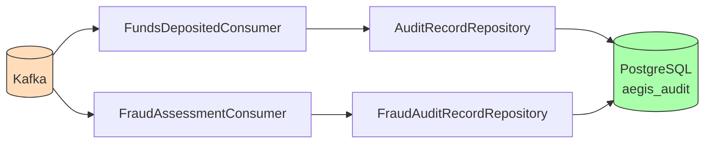

# Audit Service

**Purpose**: Persists immutable audit records of financial events for compliance, forensics, and regulatory reporting.

## Functionality

- Consumes `FundsDeposited` events from Kafka topic `wallet.funds.deposited`
- Persists every event as an immutable `AuditRecord` with full payload
- Tracks ingestion timestamp for SLA monitoring

## Architecture

## Tech Stack

- Java 21, Spring Boot 3.3, Spring Kafka
- PostgreSQL, Flyway migrations
- Testcontainers for integration tests

## Configuration

| Property | Value |
|----------|-------|
| Port | 8088 |
| Database | `aegis_audit` |
| Kafka consumer group | `audit-group` |

## Event Consumers

| Event | Topic | Action |
|-------|-------|--------|
| FundsDeposited | `wallet.funds.deposited` | Persists AuditRecord with all event fields |
