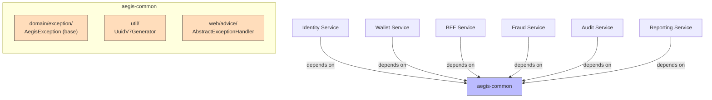

# Common Module

**Purpose**: Shared library used by all Aegis microservices. Contains cross-cutting concerns and shared abstractions.

## Contents

| Class | Purpose |
|-------|---------|
| `UuidV7Generator` | UUIDv7 generation (time-ordered, DB-friendly identifiers) |
| `AegisException` | Base class for all domain exceptions with `code` and `message` |

## Usage

Add as a dependency in any service's `pom.xml`:

```xml
<dependency>
    <groupId>com.aegis</groupId>
    <artifactId>aegis-common</artifactId>
    <version>${project.version}</version>
</dependency>
```

## Conventions

- Domain exceptions MUST extend `AegisException`
- Identifiers should use `UuidV7Generator.generate()` for time-ordered UUIDs

## Architecture



### Module Structure

| Package | Contents | Purpose |
|---------|----------|---------|
| `com.aegis.common.domain.exception` | `AegisException` | Base class for all domain exceptions with `code` and `message` |
| `com.aegis.common.util` | `UuidV7Generator` | UUIDv7 generation (time-ordered, DB-friendly identifiers) |
| `com.aegis.common.web.advice` | `AbstractExceptionHandler` | Base `@RestControllerAdvice` for consistent error responses |
