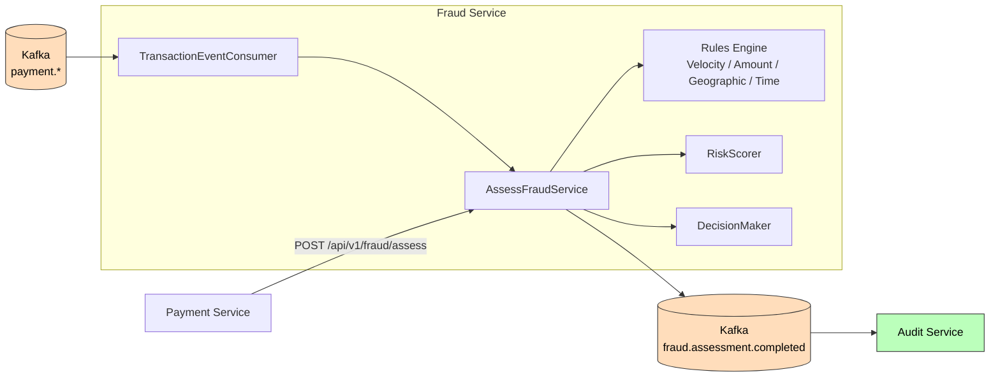

# Fraud Service

**Purpose**: Real-time fraud detection engine with configurable rules, risk scoring, and approve/review/reject decisions.

## Functionality

- Assesses transactions against configurable fraud rules (velocity, amount threshold, geographic, time-based)
- Aggregates rule evaluations into a composite risk score (0-100)
- Generates decisions: APPROVE (< 30), REVIEW (30-70), REJECT (> 70)
- Publishes `FraudAssessmentCompleted` to Kafka topic `fraud.assessment.completed`
- Consumes transaction events from `payment.transfer.requested`
- Exposes synchronous `POST /api/v1/fraud/assess` for real-time calls

## Architecture

## Tech Stack

- Java 21, Spring Boot 3.3, Spring Kafka
- PostgreSQL, Flyway migrations
- Testcontainers for integration tests

## Configuration

| Property | Value |
|----------|-------|
| Port | 8089 |
| Database | `aegis_fraud` |
| Kafka consumer group | `fraud-group` |
| Review threshold | 30 (score < 30 → APPROVE) |
| Reject threshold | 70 (score > 70 → REJECT) |

## Rules

Rules are stored in the `fraud_rules` table and configurable without code changes:

| Rule | Type | Default threshold | Default weight |
|------|------|-------------------|-----------------|
| VELOCITY_CHECK | VELOCITY | 5 | 25 |
| AMOUNT_THRESHOLD | AMOUNT | 1000 | 30 |
| GEOGRAPHIC_ANOMALY | GEOGRAPHIC | 0 | 30 |
| OFF_HOURS_TRANSACTION | TIME | 0 | 15 |

## API

- `POST /api/v1/fraud/assess` — synchronous assessment
- `GET /api/v1/fraud/assessments/{id}` — retrieve assessment details
