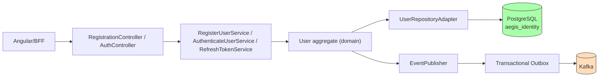

# Identity Service

**Purpose**: User identity management — registration, authentication, and JWT token lifecycle with account lifecycle states (verification, lockout, suspension).

## Functionality

- User registration with BCrypt password hashing and email validation
- Authentication (email + password) issuing JWT access/refresh token pairs
- Refresh token rotation
- Account lockout after failed attempts, suspension, and closing
- Publishes domain events (`UserRegistered`, `UserAuthenticated`, `UserAccountLocked`) via transactional outbox

## Architecture

## Tech Stack

- Java 21, Spring Boot 3.3, Spring Security
- PostgreSQL, Flyway migrations
- Kafka (transactional outbox)
- JJWT 0.12.6

## Configuration

| Property | Value |
|----------|-------|
| Port | 8081 |
| Database | `aegis_identity` |
| JWT access token | 15 min (configurable) |
| JWT refresh token | 7 days (configurable) |
| Password hashing | BCrypt |

## API Endpoints

| Method | Path | Description |
|--------|------|-------------|
| POST | `/api/v1/auth/register` | Register a new user |
| POST | `/api/v1/auth/login` | Authenticate and get token pair |
| POST | `/api/v1/auth/refresh` | Rotate refresh token |

## Domain Models

- `User` (aggregate), `UserId`, `Email`, `PasswordHash`, `Credentials`, `TokenPair`, `UserStatus`
