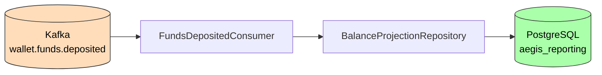

# Reporting Service

**Purpose**: Maintains denormalized read models for reporting and dashboards by consuming domain events.

## Functionality

- Consumes `FundsDeposited` events from Kafka topic `wallet.funds.deposited`
- Upserts `BalanceProjection` records (read-model) by wallet ID
- Provides a queryable balance view aggregated from deposit events

## Architecture

## Tech Stack

- Java 21, Spring Boot 3.3, Spring Kafka
- PostgreSQL, Flyway migrations
- Testcontainers for integration tests

## Configuration

| Property | Value |
|----------|-------|
| Port | 8087 |
| Database | `aegis_reporting` |
| Kafka consumer group | `reporting-group` |

## Event Consumers

| Event | Topic | Action |
|-------|-------|--------|
| FundsDeposited | `wallet.funds.deposited` | Upserts BalanceProjection |
