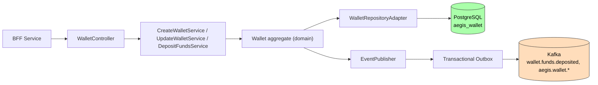

# Wallet Service

**Purpose**: Wallet lifecycle management — create, deposit funds, adjust balance, and deactivate wallets with full ledger tracking.

## Functionality

- Create wallets (max 5 per user, configurable)
- Deposit funds with source tracking and reference idempotency
- Adjust balance (deposit positive, withdraw negative) with ledger entries
- Update wallet status (FROZEN, CLOSED) — deactivation requires zero balance
- Premium flag when balance > 1000 EUR
- Publishes domain events via transactional outbox

## Architecture

## Tech Stack

- Java 21, Spring Boot 3.3
- PostgreSQL, Flyway migrations
- Kafka (transactional outbox)

## Configuration

| Property | Value |
|----------|-------|
| Port | 8083 |
| Database | `aegis_wallet` |
| Max wallets per user | 5 (configurable) |
| Outbox polling | 1000ms |

## API Endpoints

| Method | Path | Description |
|--------|------|-------------|
| POST | `/api/v1/wallets` | Create wallet |
| GET | `/api/v1/wallets` | List wallets |
| GET | `/api/v1/wallets/{id}` | Get wallet detail (includes premium flag) |
| POST | `/api/v1/wallets/{id}/deposits` | Deposit funds (source + reference, idempotent) |
| PATCH | `/api/v1/wallets/{id}/balance` | Adjust balance |
| PATCH | `/api/v1/wallets/{id}/status` | Update status (FROZEN, CLOSED) |

## Domain Models

- `Wallet` (aggregate), `WalletId`, `WalletStatus`, `LedgerEntry`, `LedgerEntryType`

## Events Produced

| Event | Topic |
|-------|-------|
| `WalletCreated` | `aegis.wallet.wallet-created` |
| `WalletBalanceAdjusted` | `aegis.wallet.balance.adjusted` |
| `FundsDeposited` | `wallet.funds.deposited` |
