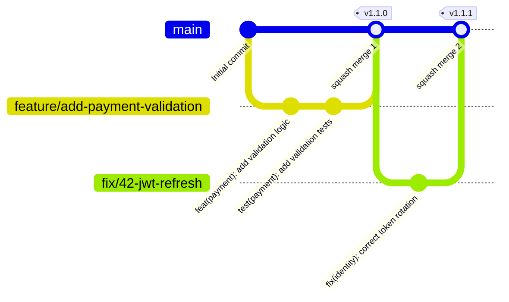
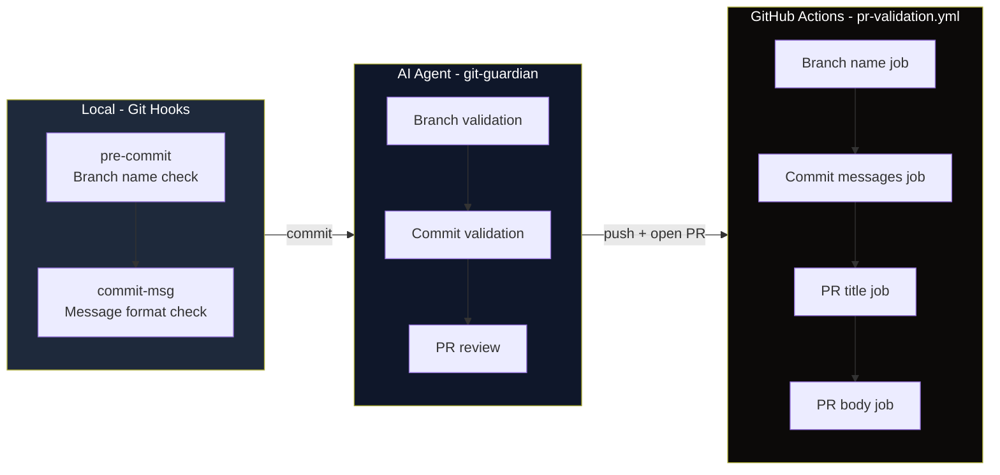
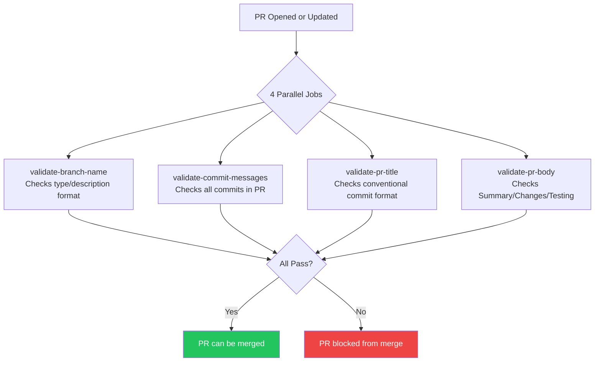
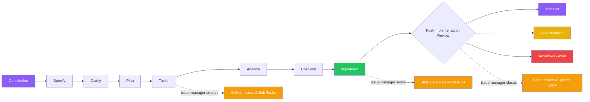
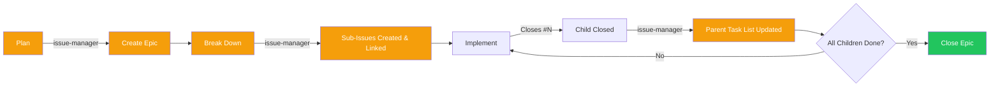

# Aegis - Agents & Workflows

This document describes the AI agent system, git workflow, and CI/CD pipeline for the Aegis digital payment platform.

## Agent Overview

Aegis uses a set of specialized AI agents configured in `opencode.json`. Each agent handles a specific domain of the development lifecycle.

| Agent | Model | Role |
|-------|-------|------|
| `issue-manager` | qwen3.7-max | Manages GitHub issue lifecycle: triage, linking, sync, status reports |
| `architect` | qwen3.7-max | Validates DDD boundaries, microservice decomposition, C4 models |
| `security-reviewer` | deepseek-v4-flash | Reviews OAuth2/JWT, scans secrets, OWASP compliance |
| `code-reviewer` | qwen3.7-plus | Enforces SOLID, Clean Code, hexagonal architecture |
| `service-builder` | kimi-k2.7-code | Generates Spring Boot microservices |
| `frontend-builder` | kimi-k2.7-code | Generates Angular components and services |
| `test-engineer` | qwen3.7-plus | Generates JUnit 5, Mockito, Testcontainers tests |
| `infra-engineer` | qwen3.7-plus | Creates Docker, Kubernetes, Helm, GitHub Actions |
| `reporter` | deepseek-v4-flash-free | Creates GitHub issues (bugs, features, tech debt) |
| `git-guardian` | deepseek-v4-flash-free | Enforces branch naming, commits, and PR conventions |

### Agent Routing

```mermaid
flowchart TD
    TASK[Task Arrives] --> PHASE{Which Phase?}

    PHASE -->|Planning| PLAN_ROUTE{Issue Work?}
    PLAN_ROUTE -->|Create epic/feature| IM[issue-manager]
    PLAN_ROUTE -->|Break down issue| IM2[issue-manager]
    PLAN_ROUTE -->|Triage / status| IM3[issue-manager]

    PHASE -->|Setup| SETUP_ROUTE{Task Type?}
    SETUP_ROUTE -->|Docker/Helm/K8s| INFRA[infra-engineer]
    SETUP_ROUTE -->|Maven/Packages| SB[service-builder]

    PHASE -->|Foundational| SB

    PHASE -->|User Story| STORY_ROUTE{Task Type?}
    STORY_ROUTE -->|Angular/UI| FB[frontend-builder]
    STORY_ROUTE -->|Kafka/Events| SB2[service-builder + event-design]
    STORY_ROUTE -->|REST/API| SB3[service-builder + api-design]
    STORY_ROUTE -->|Entity/Model/Service| SB
    STORY_ROUTE -->|Test/Coverage| TE[test-engineer]
    STORY_ROUTE -->|Security/OAuth2| SB4[service-builder then security-reviewer]

    PHASE -->|Polish| POLISH_ROUTE{Task Type?}
    POLISH_ROUTE -->|Tests/Coverage| TE
    POLISH_ROUTE -->|Code Quality| CR[code-reviewer]
    POLISH_ROUTE -->|Security Audit| SR[security-reviewer]
    POLISH_ROUTE -->|Architecture| AR[architect]

    PHASE -->|Close| CLOSE_ROUTE{Issue Done?}
    CLOSE_ROUTE -->|Close + sync| IM4[issue-manager]
    CLOSE_ROUTE -->|PR validation| GG[git-guardian]

    style IM fill:#f59e0b,color:#fff
    style IM2 fill:#f59e0b,color:#fff
    style IM3 fill:#f59e0b,color:#fff
    style IM4 fill:#f59e0b,color:#fff
    style INFRA fill:#3b82f6,color:#fff
    style SB fill:#22c55e,color:#fff
    style SB2 fill:#22c55e,color:#fff
    style SB3 fill:#22c55e,color:#fff
    style SB4 fill:#22c55e,color:#fff
    style FB fill:#06b6d4,color:#fff
    style TE fill:#a855f7,color:#fff
    style CR fill:#eab308,color:#fff
    style SR fill:#ef4444,color:#fff
    style AR fill:#8b5cf6,color:#fff
    style GG fill:#22d3ee,color:#fff
```



## Git Workflow (GitHub Flow)

All development follows GitHub Flow with strict naming conventions.



### Branch Naming

```
<type>/<short-description>
```

| Type | Purpose |
|------|---------|
| `feature/` | New functionality |
| `fix/` | Bug fixes |
| `chore/` | Maintenance, tooling |
| `refactor/` | Code restructuring |
| `docs/` | Documentation |
| `test/` | Test additions |
| `ci/` | CI/CD changes |
| `security/` | Security fixes |

### Commit Messages

```
<type>(<scope>): <description>
```

| Type | Scope |
|------|-------|
| `feat`, `fix`, `refactor`, `test`, `docs`, `chore`, `ci`, `perf`, `security` | `identity`, `wallet`, `payment`, `fraud`, `notification`, `audit`, `reporting`, `gateway`, `infra`, `frontend` |

## Enforcement Pipeline

Three layers of enforcement ensure conventions are followed at every stage:



### Git Hooks

Located in `.githooks/`. Enable with:

```bash
git config core.hooksPath .githooks
```

| Hook | Trigger | Action |
|------|---------|--------|
| `pre-commit` | Before each commit | Warns if branch name does not follow convention |
| `commit-msg` | After writing message | **Blocks** commit if message does not match format |

### GitHub Actions - PR Validation

Triggered on every PR event (`opened`, `edited`, `synchronize`, `reopened`):



## Specification-Driven Development

Features follow the Specify lifecycle managed by speckit workflows:



## Quick Reference

### Using the issue-manager agent

The `issue-manager` agent is your project manager for all GitHub issue operations. Use it at every stage of the development lifecycle.

**Before starting work:**
- "Create epic for [feature name]" — scaffolds the epic with sub-issues per service, links them all
- "Break down #N" — decomposes a feature into implementation, test, and documentation sub-tasks

**While working:**
- "Sync issues" — fixes broken links, updates parent task lists, checks label consistency
- "What's blocked?" — lists all issues waiting on unresolved dependencies
- "Link #A to #B" — creates cross-references between related issues

**After completing work:**
- "Close #N" — verifies all children are closed, updates parent checklist, closes issue
- "Status report" — generates epic progress table, blocked items, stale issues, risk flags

**Maintenance:**
- "Triage" — classifies unlabeled/unassigned issues, applies labels, suggests assignees
- "Prioritize" — sorts open issues by impact/urgency matrix, suggests reordering

#### Issue Lifecycle



#### Issue Hierarchy & Labels

```
Epic (label: epic)
 ├── Feature / Story (label: enhancement)
 │    ├── Sub-task: implementation
 │    ├── Sub-task: tests (label: test)
 │    └── Sub-task: documentation (label: documentation)
 ├── Bug (label: bug)
 └── Tech Debt (label: tech-debt)

Scope labels:   identity | wallet | payment | fraud | notification | audit | reporting | gateway | infra | frontend
Priority labels: priority-critical | priority-high | priority-medium | priority-low
Size labels:    size-small | size-medium | size-large | size-xlarge
```

### Using the git-guardian agent

Ask the `git-guardian` agent to validate your work:

- "Validate my branch name"
- "Check my last 5 commit messages"
- "Review this PR for convention compliance"

### Common commands

```bash
# Enable git hooks
git config core.hooksPath .githooks

# Create a feature branch
git checkout -b feature/add-payment-validation

# Commit with conventional message
git commit -m "feat(payment): add idempotency key to payment creation"

# Push and open a PR
git push -u origin feature/add-payment-validation
```

### PR Body Template

```markdown
## Summary
What this PR does and why.

## Changes
- Change 1
- Change 2

## Testing
How this was tested.

## Checklist
- [ ] Follows hexagonal architecture conventions
- [ ] Unit tests added/updated
- [ ] Integration tests added/updated (if applicable)
- [ ] OpenAPI docs updated (if API changed)
- [ ] No secrets or hardcoded credentials
- [ ] `mvn checkstyle:check` passes
- [ ] `mvn test` passes
```
