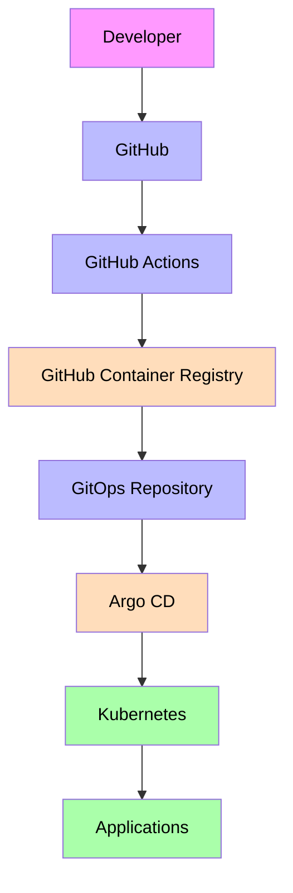
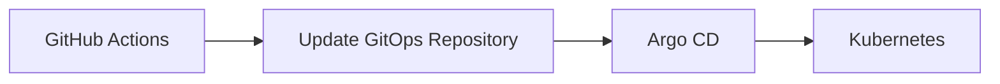
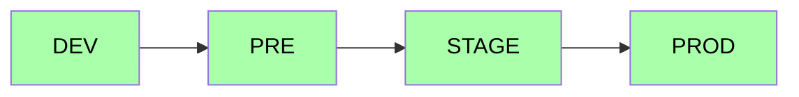

# Aegis Platform Engineering Vision

## Objective

The goal of Aegis is **not simply to build an application**, but to build a **production-oriented cloud platform** that demonstrates the skills expected from a Software Architect or Platform Engineer.

Every technology introduced into the platform must have a clear architectural purpose and follow modern DevOps, GitOps and Cloud Native best practices.

The platform should resemble the engineering infrastructure of a real SaaS company rather than a personal project.

## Platform Principles

- Infrastructure as Code.
- GitOps as the deployment model.
- Immutable deployments.
- Automated CI/CD.
- Secure Software Supply Chain.
- Full Observability.
- Environment isolation.
- Production-like local development.
- Everything version controlled.

No manual deployments should exist. Everything should be reproducible from Git.

## Platform Architecture

The CI pipeline builds and validates the software. The CD pipeline never deploys directly. Instead, it updates the GitOps repository. Argo CD continuously synchronizes Kubernetes with the desired state stored in Git.

## Development Environment

The local platform should reproduce a real production environment.

### Docker Desktop

- **Purpose**: Container runtime, base infrastructure for local Kubernetes.
- **Why**: Everything in the platform runs as containers.

### miniKube

- **Purpose**: Run lightweight Kubernetes clusters inside Docker.
- **Example**: `aegis-dev`, `aegis-pre`. Later, additional clusters can simulate production environments.

### kubectl

- **Purpose**: Official Kubernetes CLI.
- **Responsibilities**: deploy resources, debug workloads, inspect pods, manage namespaces, execute commands. Primary operational tool.

### Helm

- **Purpose**: Package manager for Kubernetes.
- **Responsibilities**: install platform components, version deployments, parameterize applications.
- Every Aegis microservice should eventually become a Helm Chart.

### Headlamp

- **Purpose**: Graphical Kubernetes dashboard.
- **Responsibilities**: inspect resources, view deployments, view logs, debug workloads. Primary Kubernetes GUI.

### k9s

- **Purpose**: Terminal-based Kubernetes management.
- **Responsibilities**: logs, pod management, deployments, events, scaling, shell access. Daily operational tool.

## GitOps

GitOps is the deployment strategy. No deployment should ever execute `kubectl apply` manually:

Git becomes the single source of truth.

## Argo CD

- **Purpose**: Continuous Deployment platform.
- **Responsibilities**: watch Git repositories, detect changes, synchronize Kubernetes, self-heal deployments, roll back if necessary.
- Argo CD owns the deployment process. GitHub Actions only builds software.

## GitHub Actions

- **Responsibilities**: validate Pull Requests, execute tests, build Docker images, scan vulnerabilities, generate SBOM, push images, update GitOps repository.
- It should never deploy directly.

## GitHub Container Registry (GHCR)

- **Purpose**: Store Docker images.
- **Flow**: Build → Push → Argo CD → Deploy.
- Every deployment should reference immutable image tags.

## Kubernetes

- Acts as the runtime platform.
- **Responsibilities**: run workloads, service discovery, scaling, high availability, resource management.
- Everything executes inside Kubernetes.

## Helm Structure

Every service should have its own chart: `charts/identity`, `charts/wallet`, `charts/frontend`, `charts/bff`.

Each chart contains: Deployment, Service, ConfigMaps, Secrets, Ingress.

## Environment Strategy

Each environment contains different configuration.

## Overlays

Configuration must never be duplicated. The platform should use `base/` + `overlays/dev|pre|stage|prod`. Each overlay overrides only environment-specific configuration: replicas, resources, environment variables, autoscaling, ingress, limits.

## Observability

Every service should expose telemetry.

| Component | Role |
|-----------|------|
| **Prometheus** | Collects metrics (CPU, memory, requests, error rate, latency) |
| **Grafana** | Visualizes metrics (dashboards, alerts, platform monitoring) |
| **Loki** | Centralized log storage (all containers send logs here) |
| **Tempo** | Distributed tracing (tracks requests across microservices) |
| **OpenTelemetry** | Instrumentation layer exporting metrics, logs and traces |

Every microservice should be instrumented using OpenTelemetry.

## Networking

### NGINX Ingress
Entry point into the cluster: HTTP routing, TLS, reverse proxy.

### cert-manager
Automatically manages TLS certificates. No certificate should be manually installed.

## Security

Security should be integrated into the CI pipeline.

| Tool | Role |
|------|------|
| **Gitleaks** | Detects secrets committed to Git |
| **CodeQL** | Static Application Security Testing (SAST) |
| **Trivy** | Scans Docker images, dependencies and Kubernetes manifests (CVEs) |
| **Syft** | Generates SBOM (inventory of dependencies) |
| **Cosign** | Signs Docker images (only trusted artifacts deployed) |
| **Dependabot / Renovate** | Automatically keeps dependencies updated |

## CI/CD Strategy

### Pull Request Validation
Fast validation: build, unit tests, lint, coverage. Target duration: less than one minute.

### Merge CI
Runs after merging into main: full build, integration tests, Docker build, security scanning, push to GHCR, GitOps update.

### Continuous Deployment
Argo CD detects Git changes, deploys automatically, executes health checks, synchronization and rollback if required.

## Future Enhancements

- Argo Rollouts
- Blue/Green deployments
- Canary deployments
- External Secrets
- HashiCorp Vault
- KEDA
- OPA Gatekeeper or Kyverno
- Policy as Code
- DORA Metrics
- Automated Release Notes
- Slack / Teams notifications

## Expected Outcome

The final platform should demonstrate:

- Production-oriented CI/CD
- GitOps workflows
- Kubernetes expertise
- Secure Software Supply Chain
- Cloud Native Architecture
- Production-oriented observability
- Infrastructure automation
- Modern DevOps practices

The objective is to make Aegis indistinguishable from the engineering platform of a modern technology company.
