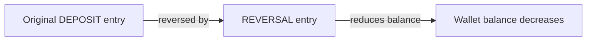

# Compensations and Reversals

> **Status:** Design documented (this PR). Implementation: `REVERSAL` ledger entry
> type + `reverseDeposit` use case (next PR).

## Principle

**Ledger entries are immutable. Corrections are recorded as new compensating
entries, never by editing completed operations.**

This follows ADR-004 (single-entry per-aggregate ledger) and guarantees a complete,
auditable financial history.

## Compensating entry model

A reversal of a deposit creates a new `LedgerEntry` of type `REVERSAL` that:

- references the original entry via `reversalOf` (the original `LedgerEntry.id`);
- carries the **same** absolute amount and currency as the original;
- is stored with the original entry's idempotency reference (`reference`), so
  reversing the same deposit twice is rejected (unique index extension).



## Invariant

After a reversal:

```
w.balance == original_balance - reversed_amount
ledger_entries contains BOTH the original DEPOSIT and the REVERSAL
```

The original entry is never touched.

## Domain types

| Type | Direction | Used for |
|------|-----------|----------|
| `DEPOSIT` | inflow | Funds added to the wallet |
| `REVERSAL` | outflow | Reversing a previously applied deposit |
| `WITHDRAWAL` | outflow | Operator-initiated balance reduction |
| `TRANSFER_OUT` / `TRANSFER_IN` | out/in | Future transfers |
| `PAYMENT` | outflow | Future payments |
| `REFUND` | inflow | Future refunds |

## Rules

1. Only entries of type `DEPOSIT` can be reversed (initially).
2. A `REVERSAL` must reference an existing, non-reversed deposit entry.
3. A deposit can be reversed at most once (idempotency on `reversalOf`).
4. The reversal amount must equal the original deposit amount (full reversal).
5. Reversing does not change the wallet status; it only reduces the balance.

## API (planned, next PR)

```
POST /api/v1/wallets/{walletId}/deposits/{depositId}/reversal
```

Request body carries the idempotency `reference` for the reversal. Response is the
updated balance plus the new reversal entry id.

## See also

- [ADR-004: Ledger design](../adr/ADR-004-ledger-single-entry.md)
- [Wallet balance model](wallet-balance.md)
- [Idempotency](idempotency.md)
