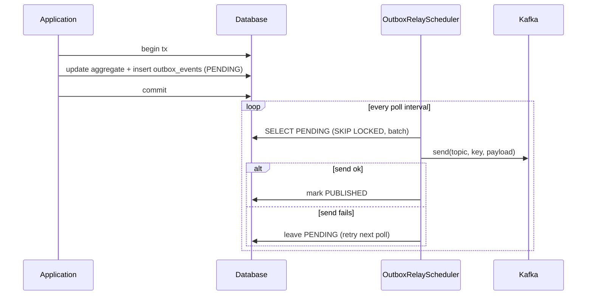

# Outbox Failure Handling

> **Status:** Partially implemented. The transactional outbox exists
> (`outbox_events` table + `OutboxRelayScheduler`); the
> `aegis.outbox.pending_events` metric is exposed. Recovery replay tests are
> planned.

## Architecture

The transactional outbox guarantees that a domain change and its event are
committed atomically, and that the event is eventually published to Kafka even if
the producer crashes between commit and publish.



## Failure modes and recovery

| Failure | Behaviour | Recovery |
|---------|-----------|----------|
| Producer crashes after commit, before mark-as-published | Event stays `PENDING`; **at-least-once** redelivery after restart | Consumer dedup (`processed_events`) prevents double-apply |
| Kafka broker down during relay | `kafkaTemplate.send(...).get()` times out (5s); event stays `PENDING` | Relay retries on the next poll |
| Publish succeeds but DB update fails (e.g. connection drop) | Event marked `PUBLISHED` in memory but DB write rolls back → event stays `PENDING` → **published twice** | Consumer dedup by `eventId` |
| Deserialization error on consumer | Consumer retries, then DLT | See [Retries and Dead Letter Topics](retry-dlt.md) |
| No topic configured for event type | Relay logs a warning and marks the event `PUBLISHED` (no message sent) | Operator must add the topic mapping |

## Delivery semantics

- **Guarantee:** at-least-once. A message may be delivered more than once.
- **Idempotency:** every consumer deduplicates by `eventId`; producers use UUIDv7
  event ids.

## Operational metric

`OutboxRelayScheduler` exposes a Micrometer gauge:

```
aegis.outbox.pending_events{application="aegis-wallet-service"}
```

It reflects the number of `PENDING` outbox rows after each relay cycle. A sustained
non-zero value indicates the outbox is blocked (Kafka unavailable, DB issue, topic
mapping missing).

**Planned follow-ups**

- Alert on `aegis.outbox.pending_events > 0` for more than N minutes.
- Test that simulates the Kafka producer failing mid-relay and verifies the event
  is eventually published and consumers do not double-apply.

## Concurrency

- The relay uses `PESSIMISTIC_WRITE` + `SKIP LOCKED` (migration
  `V2__add_outbox_lock_index.sql`) so multiple instances do not process the same
  row concurrently.

## See also

- [Deposit Flow](sequences/deposit-flow.md)
- [Idempotency](idempotency.md)
- [Retries and Dead Letter Topics](retry-dlt.md)
