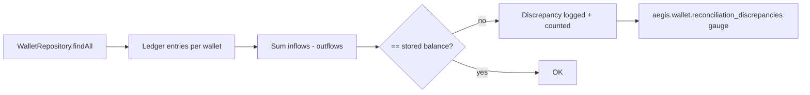

# Ledger Reconciliation

> **Status:** Implemented (Wallet service). A scheduled job recomputes each
> wallet's balance from its immutable ledger entries and reports drift.

## Objective

Guarantee the ADR-004 ledger invariant:

```
balance == SUM(inflows) - SUM(outflows)
```

A discrepancy means the derived projection (the stored `balance` column) has
drifted from the source of truth (the immutable `ledger_entries`). Detecting this
automatically is what makes the single-entry ledger defensible.

## Implementation

`LedgerReconciliationService` (Wallet service) runs on a fixed delay and, for every
wallet:

1. loads the ledger entries (`findByWalletIdOrderByCreatedAtAsc`),
2. sums them using signed amounts by entry type,
3. compares the sum with the stored `balance`,
4. logs and records any mismatching wallet as a `Discrepancy`.



## Entry type classification

| Inflows (positive) | Outflows (negative) |
|--------------------|---------------------|
| `OPENING` | `WITHDRAWAL` |
| `DEPOSIT` | `TRANSFER_OUT` |
| `TRANSFER_IN` | `PAYMENT` |
| `REFUND` | `REVERSAL` |

`REVERSAL` is classified as an outflow because it reduces the balance by the
original deposit amount.

## Configuration

```yaml
aegis:
  wallet:
    reconciliation:
      interval-ms: 60000
      discrepancy-limit: 0   # log ERROR when more than this many discrepancies
```

## Metric

`aegis.wallet.reconciliation_discrepancies` (gauge) — number of wallets whose
stored balance differs from the ledger sum after the last run. A sustained non-zero
value should trigger an alert and a data investigation.

## What a discrepancy means

- A wallet's `balance` was updated without a corresponding ledger entry (or vice
  versa), or
- a ledger entry was modified/deleted (should be impossible: entries are
  append-only, the persistence layer exposes no update/delete path).

## Planned

- Reconciliation report persisted/exported (CSV/JSON) for audit evidence.
- Reconciliation against an external provider simulation (deposit source).

## See also

- [ADR-004: Ledger design](../adr/ADR-004-ledger-single-entry.md)
- [Wallet balance model](wallet-balance.md)
- [Deposit Flow](sequences/deposit-flow.md)
