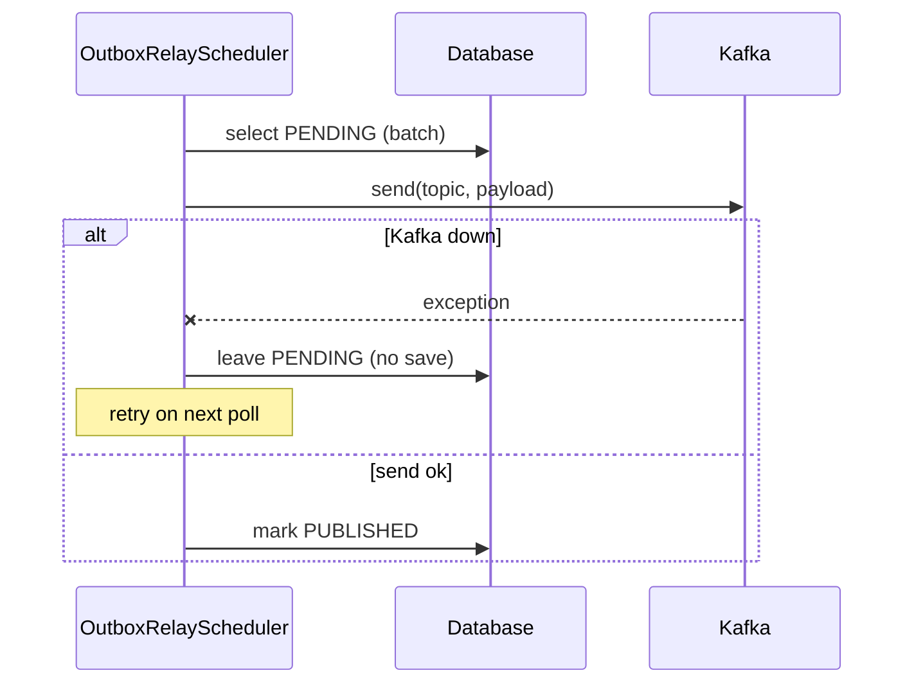

# Resilience Testing

> **Status:** Implemented (outbox resilience + poison message/DLT). Chaos-style
> container tests are planned.

## What is verified

| Scenario | Test | Result expected |
|----------|------|-----------------|
| Kafka unavailable during outbox relay | `OutboxRelaySchedulerResilienceTest` | Event stays `PENDING`; retried next poll (no loss) |
| Kafka send succeeds | `OutboxRelaySchedulerResilienceTest` | Event marked `PUBLISHED` |
| Missing topic mapping | `OutboxRelaySchedulerResilienceTest` | Event skipped (marked published) with warning, no crash |
| Poison message (malformed payload) | `DeadLetterTopicIT` (Audit) | Retried, then routed to `<topic>.dlt` |
| Concurrent duplicate deposit | `ConcurrentDepositIdempotencyIT` (Wallet) | Exactly one succeeds, rest rejected |

## Outbox resilience

The transactional outbox must survive a Kafka outage without losing events.

`OutboxRelaySchedulerResilienceTest` mocks a failed Kafka send and asserts the event
is **not** marked published, proving at-least-once delivery semantics.

## Poison message / DLT

`DeadLetterTopicIT` (Audit service, Testcontainers) publishes a malformed payload
to `wallet.funds.deposited` and asserts the record appears on
`wallet.funds.deposited.dlt` after the configured retries are exhausted. See
[Retries and Dead Letter Topics](retry-dlt.md).

## Planned (chaos)

- Stop the Kafka container mid-run (Testcontainers chaos) and verify the outbox
  buffers and drains after restart.
- Stop a PostgreSQL container and verify consumers retry via the Kafka error
  handler, then recover.

## See also

- [Retries and Dead Letter Topics](retry-dlt.md)
- [Outbox failure handling](outbox-failure.md)
- [Load testing](../../load/README.md)
- [SLIs and SLOs](../observability/slo.md)
