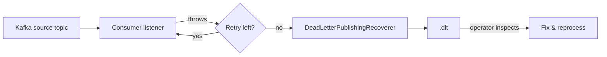

# Retries and Dead Letter Topics

> **Status:** Implemented for the Audit, Reporting and Fraud consumers.

## Retry policy

All Kafka consumers are configured with a `DefaultErrorHandler` that retries
transient failures with a **fixed back-off** and then routes the failed record to a
**dead letter topic (DLT)**.

Configuration (per service, `application.yml`):

```yaml
aegis:
  kafka:
    retry:
      max-attempts: 3      # initial attempt + 2 retries
      backoff-ms: 1000     # fixed delay between attempts
    dlt-suffix: .dlt       # DLT name = <topic>.dlt
```

### Recoverable vs non-recoverable

| Category | Examples | Policy |
|----------|----------|--------|
| **Retryable (transient)** | DB connection loss, downstream timeout, Kafka broker briefly unavailable | Retried with back-off up to `max-attempts` |
| **Non-retryable (permanent)** | Malformed payload, deserialization failure, domain violation | Retried anyway (bounded), then sent to the DLT |

`DefaultErrorHandler` treats every thrown exception as retryable for a bounded number
of attempts. This is a deliberate simplification: a poison message is retried a few
times (cheap, usually sub-second) before landing in the DLT for inspection.

## Dead letter topics

The `DeadLetterPublishingRecoverer` publishes the failed record to
`<source-topic>.dlt`, preserving the original key, value, headers and metadata.

```
wallet.funds.deposited          (source)
wallet.funds.deposited.dlt      (dead letter)
fraud.assessment.completed
fraud.assessment.completed.dlt
payment.transfer.requested
payment.transfer.requested.dlt
```

### DLT workflow



### Inspection and reprocessing

- Consume the DLT with a Kafka CLI/UI (e.g. `kcat`, Redpanda Console, Grafana
  plugin) to inspect the original payload and headers.
- Fix the root cause (schema, data, code), then replay the records by republishing
  them onto the source topic (or by advancing the consumer offset after the fix).

## What is preserved

The DLT record keeps the original:

- key (`eventId` / aggregate id)
- value (original JSON payload)
- headers (including any correlation/trace headers set by the producer)

## Metrics and alerting (planned)

- `spring.kafka.listener` instrumentation provides consumer group lag and errors.
- A per-topic `retry`/`dlt` message count alert is the recommended follow-up
  (see the observability plan in `docs/obsidian/05 - Infrastructure/Observability Stack.md`).

## Poison message test

`DeadLetterTopicIT` (Audit service) publishes a malformed payload to
`wallet.funds.deposited` and asserts the record appears on
`wallet.funds.deposited.dlt` after the retries are exhausted.

## See also

- [Deposit Flow](sequences/deposit-flow.md)
- [Idempotency](idempotency.md)
- [Kafka Topics](../obsidian/05%20-%20Infrastructure/Kafka%20Topics.md)
