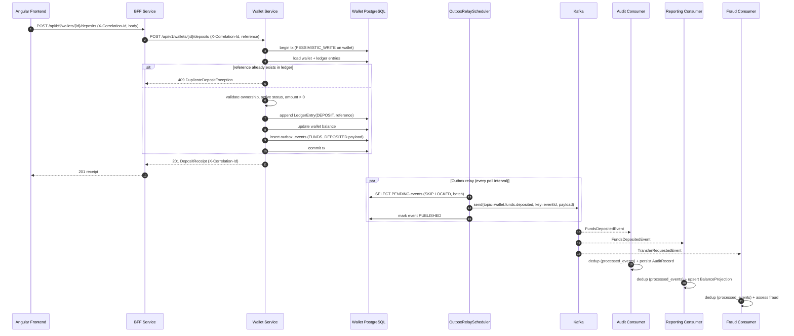

# Deposit Flow — End-to-End

> **Status:** Implemented (local/DEV); instrumentation and recovery paths partially planned.
> **Scope:** UC-004 Deposit Funds, from the BFF request to downstream consumers.

This document describes the complete deposit flow: correlation ID propagation,
idempotency, transactional outbox publication, and Kafka fan-out to Audit,
Reporting and Fraud consumers.

## Step-by-step

| # | Step | Component | Notes |
|---|------|-----------|-------|
| 1 | HTTP request | Frontend → BFF | `X-Correlation-Id` generated by the frontend if absent |
| 2 | Proxy | BFF → Wallet | BFF forwards the correlation ID and user identity header |
| 3 | Load aggregate | Wallet Service | Wallet loaded with a pessimistic lock for the transaction |
| 4 | Idempotency check | Wallet Service | In-memory scan of ledger references (fast path) |
| 5 | Ledger append | Wallet DB | New `DEPOSIT` entry with the external `reference` |
| 6 | Balance update | Wallet DB | `balance += amount` |
| 7 | Outbox insert | Wallet DB | `FUNDS_DEPOSITED` event written atomically with the ledger |
| 8 | Commit | Wallet DB | Ledger, balance and outbox are committed or rolled back together |
| 9 | HTTP 201 | Wallet → BFF → FE | Deposit receipt returned after commit |
| 10 | Outbox relay | Wallet Service | Polls `PENDING` events, publishes to Kafka, marks `PUBLISHED` |
| 11 | Fan-out | Kafka | `wallet.funds.deposited` (3 partitions, key = eventId) |
| 12 | Consumers | Audit / Reporting / Fraud | Each consumer deduplicates by `eventId` (see below) |

## Delivery guarantees

- **Transaction:** ledger + balance + outbox row share one ACID transaction.
- **Outbox:** at-least-once publication; a crash between commit and mark-as-published
  replays the event (consumers must be idempotent).
- **Consumers:** each consumer records `eventId` in `processed_events`
  (`INSERT ... ON CONFLICT DO NOTHING`) before applying the event, so a redelivery
  is a no-op.
- **Ordering:** order is preserved per partition; deposit events for the same
  wallet are serialized by the pessimistic lock on the aggregate.

## Idempotency

The `reference` supplied by the caller is the idempotency key. Two defenses exist:

1. **Application check** — `DepositFundsService` scans the wallet's ledger entries.
2. **Database constraint** — unique partial index `idx_ledger_entries_deposit_reference`
   on `(wallet_id, reference)` for `type = 'DEPOSIT' AND reference IS NOT NULL`
   (migration `V3__unique_deposit_reference.sql`). A concurrent duplicate is
   translated to `DuplicateDepositException`.

See [Idempotency](idempotency.md) for the full discussion.

## Failure handling

| Failure | Behaviour |
|---------|-----------|
| Downstream service down | BFF returns 502/503 with correlation ID; client may retry |
| Kafka unavailable during relay | Outbox row stays `PENDING`; relay retries next poll (`aegis.outbox_pending_events` gauge reflects backlog) |
| Consumer throws | Retried with fixed back-off, then routed to `<topic>.dlt` (see [Retries and Dead Letter Topics](retry-dlt.md)) |
| Duplicate redelivery | Deduplicated via `processed_events` |

## Planned (not yet implemented)

- Idempotent outbox publication (no message duplication after relay crash).
- Trace propagation of the correlation ID into Kafka record headers.
