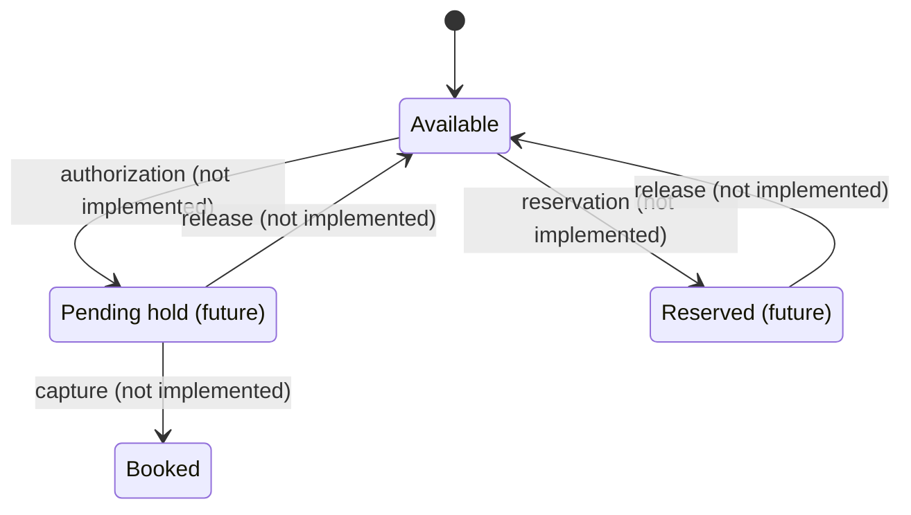

# Wallet Balance Model and Monetary Precision

> **Status:** Implemented (single `balance` field, `BigDecimal` scale 2).
> **Decision:** ADR-004 — single-entry per-aggregate ledger; the balance is a
> derived projection over immutable ledger entries.

## Balance types

The current model exposes **one balance** per wallet:

| Concept | Field | Meaning |
|---------|-------|---------|
| Booked balance | `Wallet.balance` | Money that has been applied (deposits/adjustments committed to the ledger) |

The separation into `booked` / `available` / `pending` / `reserved` is **not**
implemented. This is a deliberate scope decision: Aegis has no pending holds (card
authorizations), no scheduled settlements, and no reservation flows yet.



**Planned evolution:** when payment authorizations are introduced, add
`availableBalance = bookedBalance - reservedAmount - pendingAmount` and keep the
derived-balance invariant.

## Monetary precision

- **Type:** `java.math.BigDecimal` everywhere in the domain (`Wallet`, `LedgerEntry`,
  deposits, adjustments).
- **Scale:** 2 decimal places (minor units), matching `DECIMAL(19, 2)` in the
  database (`ledger_entries.amount`, `wallets.balance`).
- **Currency:** ISO-4217 codes validated at wallet creation (`Currency.getInstance`);
  all operations within a wallet are in the wallet's currency.
- **Rounding:** `ROUND_HALF_EVEN` (banker's rounding) is the target for any
  conversion/interest computation; currently no rounding is applied because all
  inputs are scale 2 already.
- **Comparisons:** always via `BigDecimal.compareTo`, never `equals` (scale
  sensitivity).
- **API:** amounts are serialized as JSON numbers (e.g. `100.00`).

## Ledger invariants

For a wallet `w`:

```
w.balance == SUM(entries.amount for inflow types) - SUM(entries.amount for outflow types)
```

where inflow types are `OPENING`, `DEPOSIT`, `TRANSFER_IN`, `REFUND` and outflow
types are `WITHDRAWAL`, `TRANSFER_OUT`, `PAYMENT`. The reconciliation job checks
this invariant periodically.

## See also

- [ADR-004: Ledger design](../adr/ADR-004-ledger-single-entry.md)
- [Idempotency](idempotency.md)
- [Deposit Flow](sequences/deposit-flow.md)
