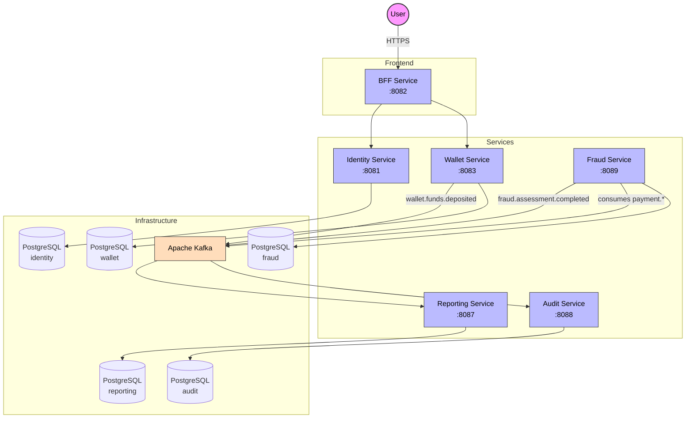
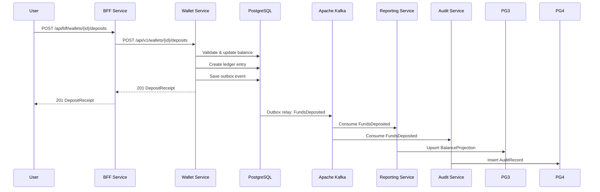
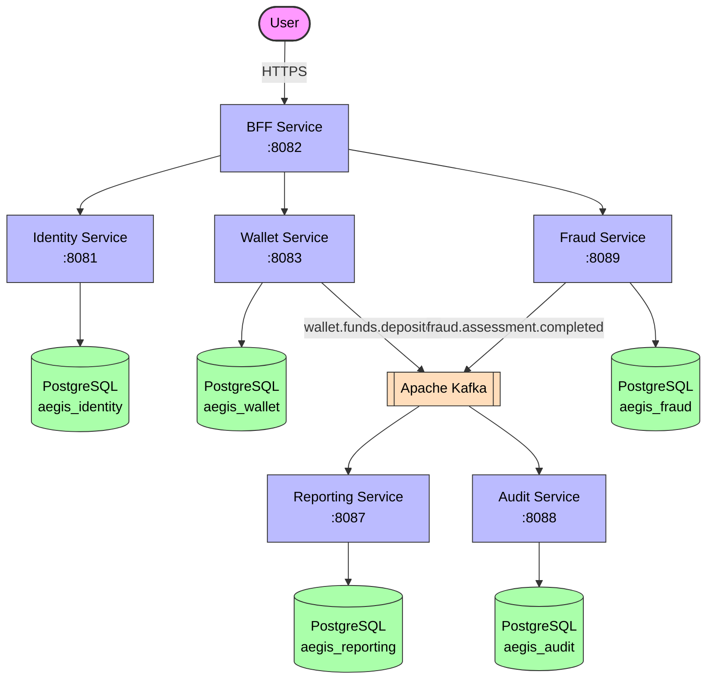

# Aegis Platform

**Enterprise-grade digital payment platform** built with microservices, event-driven architecture, and hexagonal design.

## Deposit Flow

## Context (C4 Level 1)

## Services

| Service | Port | Tech | Status |
|---------|------|------|--------|
| [[01 - Services/BFF Service\|BFF Service]] | 8082 | Spring Boot + WebClient | ✅ |
| [[01 - Services/Identity Service\|Identity Service]] | 8081 | Spring Boot + JPA + Security | ✅ |
| [[01 - Services/Wallet Service\|Wallet Service]] | 8083 | Spring Boot + JPA | ✅ |
| [[01 - Services/Reporting Service\|Reporting Service]] | 8087 | Spring Boot + JPA + Kafka | ✅ |
| [[01 - Services/Audit Service\|Audit Service]] | 8088 | Spring Boot + JPA + Kafka | ✅ |
| [[01 - Services/Fraud Service\|Fraud Service]] | 8089 | Spring Boot + JPA + Kafka | ✅ |
| [[01 - Services/Common Module\|Common Module]] | — | Shared library | ✅ |
| [[01 - Services/Frontend\|Frontend]] | 4200 | Angular 22 | ✅ |

## Domain Models

| Model | Service | Type |
|-------|---------|------|
| [[02 - Domain Models/User\|User]] | Identity | Aggregate Root |
| [[02 - Domain Models/Email\|Email]] | Identity | Value Object |
| [[02 - Domain Models/UserId\|UserId]] | Identity | Value Object |
| [[02 - Domain Models/PasswordHash\|PasswordHash]] | Identity | Value Object |
| [[02 - Domain Models/UserStatus\|UserStatus]] | Identity | Enum |
| [[02 - Domain Models/Credentials\|Credentials]] | Identity | Value Object |
| [[02 - Domain Models/TokenPair\|TokenPair]] | Identity | Value Object |
| [[02 - Domain Models/Wallet\|Wallet]] | Wallet | Aggregate Root |
| [[02 - Domain Models/WalletId\|WalletId]] | Wallet | Value Object |
| [[02 - Domain Models/WalletStatus\|WalletStatus]] | Wallet | Enum |
| [[02 - Domain Models/LedgerEntry\|LedgerEntry]] | Wallet | Value Object |
| [[02 - Domain Models/LedgerEntryType\|LedgerEntryType]] | Wallet | Enum |

## Domain Events

| Event | Producer | Topic |
|-------|----------|-------|
| [[03 - Domain Events/UserRegistered\|UserRegistered]] | Identity | `aegis.identity.user-registered` |
| [[03 - Domain Events/UserAuthenticated\|UserAuthenticated]] | Identity | `aegis.identity.user-authenticated` |
| [[03 - Domain Events/UserAccountLocked\|UserAccountLocked]] | Identity | `aegis.identity.user-account-locked` |
| [[03 - Domain Events/WalletCreated\|WalletCreated]] | Wallet | `aegis.wallet.wallet-created` |
| [[03 - Domain Events/WalletBalanceAdjusted\|WalletBalanceAdjusted]] | Wallet | `aegis.wallet.balance.adjusted` |
| [[03 - Domain Events/FundsDeposited\|FundsDeposited]] | Wallet | `wallet.funds.deposited` |
| [[03 - Domain Events/FraudAssessmentCompleted\|FraudAssessmentCompleted]] | Fraud | `fraud.assessment.completed` |

## Ports (Hexagonal Architecture)

**Inbound (Driving)**
- [[04 - Ports/inbound/RegisterUserUseCase\|RegisterUserUseCase]] → [[01 - Services/Identity Service|Identity Service]]
- [[04 - Ports/inbound/AuthenticateUserUseCase\|AuthenticateUserUseCase]] → [[01 - Services/Identity Service|Identity Service]]
- [[04 - Ports/inbound/CreateWalletUseCase\|CreateWalletUseCase]] → [[01 - Services/Wallet Service|Wallet Service]]
- [[04 - Ports/inbound/UpdateWalletUseCase\|UpdateWalletUseCase]] → [[01 - Services/Wallet Service|Wallet Service]]
- [[04 - Ports/inbound/DepositFundsUseCase\|DepositFundsUseCase]] → [[01 - Services/Wallet Service|Wallet Service]]
- [[04 - Ports/inbound/AssessFraudUseCase\|AssessFraudUseCase]] → [[01 - Services/Fraud Service|Fraud Service]]

**Outbound (Driven)**
- [[04 - Ports/outbound/UserRepository\|UserRepository]] → [[01 - Services/Identity Service|Identity Service]]
- [[04 - Ports/outbound/PasswordHasher\|PasswordHasher]] → [[01 - Services/Identity Service|Identity Service]]
- [[04 - Ports/outbound/TokenProvider\|TokenProvider]] → [[01 - Services/Identity Service|Identity Service]]
- [[04 - Ports/outbound/EventPublisher\|EventPublisher]] → [[01 - Services/Identity Service|Identity]] / [[01 - Services/Wallet Service|Wallet]]
- [[04 - Ports/outbound/WalletRepository\|WalletRepository]] → [[01 - Services/Wallet Service|Wallet Service]]

## Infrastructure

- [[05 - Infrastructure/GitOps\|GitOps]] — Declarative deployment workflow
- [[05 - Infrastructure/Argo CD\|Argo CD]] — GitOps engine, app-of-apps auto-discovery, environment promotion
- [[05 - Infrastructure/Helm Charts\|Helm Charts]] — Charts and environment overlays
- [[05 - Infrastructure/Docker Services\|Docker Services]] — Local dev stack (PostgreSQL, Kafka, Redis) via Docker Compose
- [[05 - Infrastructure/Kafka Topics\|Kafka Topics]] — Event catalog
- [[05 - Infrastructure/Database Schema\|Database Schema]] — Database schemas
- [[05 - Infrastructure/Flyway Migrations\|Flyway Migrations]] — DB versioning

> **Deployment status (dev):** all services (`identity`, `wallet`, `bff`, `frontend`) and infrastructure (`database`, `kafka`, `redis`) run in a minikube cluster, managed by Argo CD through the `app-of-apps-dev` Application. See [[05 - Infrastructure/Argo CD\|Argo CD]].

## Specifications

- [[07 - Specs/UC-001 User Registration\|UC-001 User Registration]]
- [[07 - Specs/UC-002 User Authentication\|UC-002 User Authentication]]
- [[07 - Specs/UC-003 Create Wallet\|UC-003 Create Wallet]]
- [[07 - Specs/UC-004 Deposit Funds\|UC-004 Deposit Funds]]
- [[07 - Specs/UC-008 Fraud Detection\|UC-008 Fraud Detection]]
- [[07 - Specs/UC-010 BFF\|UC-010 BFF]]

## Architecture Decisions

See [[00 - Overview/Architecture Decisions|Architecture Decisions]] for ADR index.
