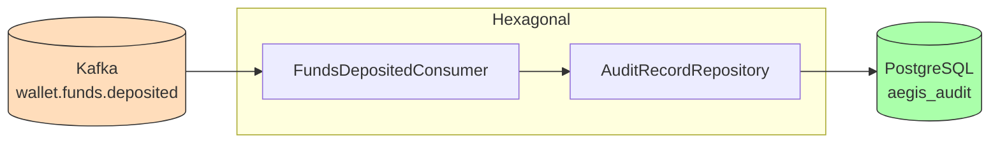
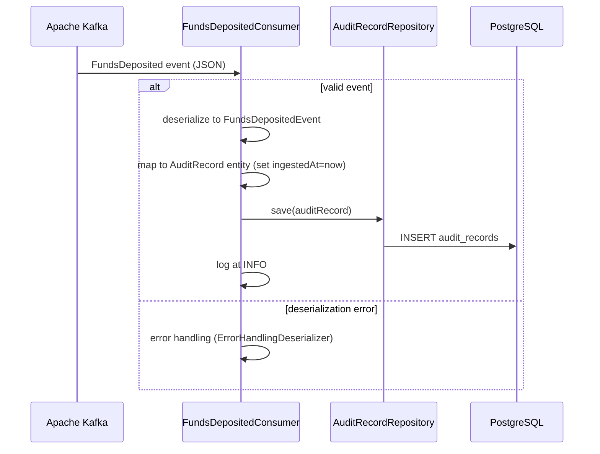

# Audit Service

**Purpose**: Persists immutable audit records of financial events for compliance, forensics, and regulatory reporting.

## Hexagonal Structure

### Domain (`com.aegis.audit.domain`)
- **Events**: `FundsDepositedEvent` (local copy for Kafka deserialization)
- **Models**: `AuditRecord` (JPA entity)

### Infrastructure (`com.aegis.audit.infrastructure`)
- **Persistence**: `AuditRecordRepository`
- **Messaging**: `FundsDepositedConsumer`
- **Config**: `KafkaConfig`

## Event Consumers

| Event | Topic | Handler | Action |
|-------|-------|---------|--------|
| [[03 - Domain Events/FundsDeposited\|FundsDeposited]] | `wallet.funds.deposited` | `FundsDepositedConsumer` | Persists `AuditRecord` with all event fields |

## Dependencies

- **Depends on**: [[01 - Services/Common Module\|Common Module]], PostgreSQL, Kafka
- **Consumes from**: [[01 - Services/Wallet Service\|Wallet Service]] (via `wallet.funds.deposited`)
