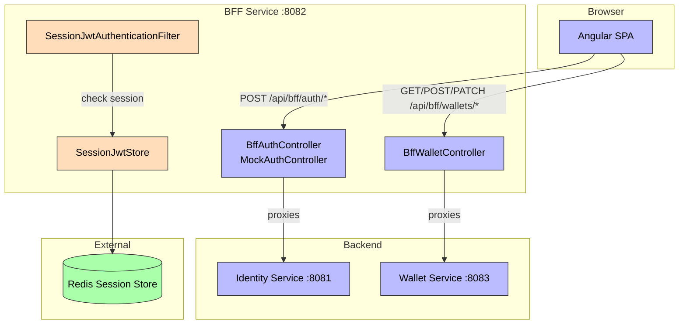
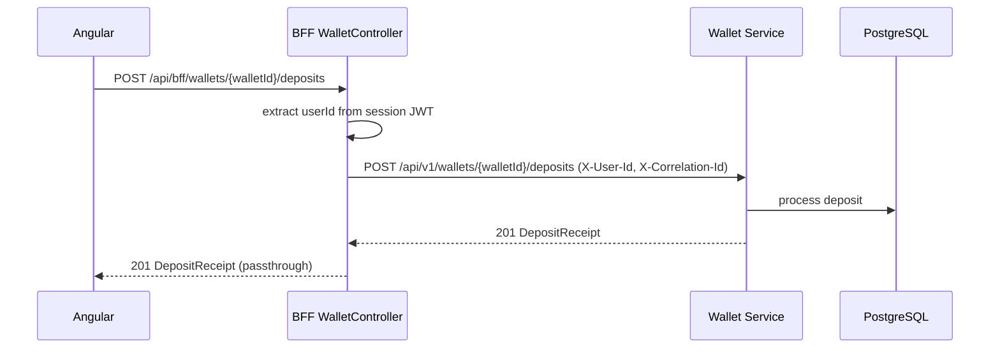

# BFF Service

**Purpose**: Backend-for-Frontend — single entry point for the Angular SPA. Handles login/logout/refresh with an HTTP session (Redis, HttpOnly cookies) and proxies authenticated requests to the Wallet Service. Mock-login is available only on the `dev` profile.

## Structure

### Core
- `BffApplication.java` — Main class
- `BffAuthController.java` — Login/refresh/logout/me endpoints
- `MockAuthController.java` — Mock-login endpoint (dev profile only)
- `BffWalletController.java` — Wallet proxy endpoints
- `BffService.java` — WebClient-based proxy to backend services
- `MockLoginService.java` — Creates a mock session (dev profile)
- `SessionJwtStore.java` — JWT storage in Redis-backed HttpSession

### Domain Ports
- `IdentityClient` — Identity Service HTTP client
- `WalletClient` — Wallet Service HTTP client
- `TokenStore` — Session-bound JWT storage
- `TokenValidator` — Validates session JWT
- `JwtSigningKey` — Shared signing key provider

### Security
- `SecurityConfig.java` — CSRF, session management, permit auth routes
- `SessionJwtAuthenticationFilter.java` — Attach JWT to proxied requests

### Config
- `BffProperties.java` — Backend service URLs
- `application.yml` — Port 8082, Redis, identity/wallet URLs
- `application-dev.yml` — Dev overrides (enables mock-login)

## API Endpoints

| Method | Path | Proxies To / Action |
|--------|------|---------------------|
| POST | `/api/bff/auth/login` | Identity: `POST /api/v1/auth/login` |
| POST | `/api/bff/auth/refresh` | Identity: `POST /api/v1/auth/refresh` |
| POST | `/api/bff/auth/logout` | Session invalidation (204) |
| GET | `/api/bff/auth/me` | Session user info |
| POST | `/api/bff/auth/mock-login` | Dev-only mock session |
| GET | `/api/bff/wallets` | Wallet: `GET /api/v1/wallets` |
| POST | `/api/bff/wallets` | Wallet: `POST /api/v1/wallets` |
| GET | `/api/bff/wallets/{walletId}` | Wallet: `GET /api/v1/wallets/{walletId}` |
| POST | `/api/bff/wallets/{walletId}/deposits` | Wallet: `POST /api/v1/wallets/{walletId}/deposits` |
| PATCH | `/api/bff/wallets/{walletId}/balance` | Wallet: `PATCH /api/v1/wallets/{walletId}/balance` |
| PATCH | `/api/bff/wallets/{walletId}/status` | Wallet: `PATCH /api/v1/wallets/{walletId}/status` |

## Dependencies

- **Depends on**: [[01 - Services/Identity Service\|Identity Service]], [[01 - Services/Wallet Service\|Wallet Service]], Redis
- **Depended by**: [[01 - Services/Frontend\|Frontend]] (all API calls go through BFF)

## Key Design Decisions

| Decision | Choice |
|----------|--------|
| Session store | Redis (distributed) |
| HTTP client | WebClient (reactive) |
| CSRF | Enabled |
| Cookie | HttpOnly, SameSite=Strict |
| Kafka | BFF neither produces nor consumes events |
