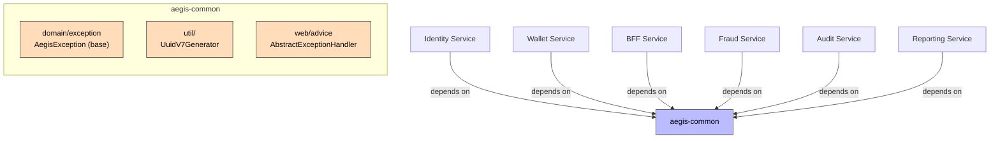

# Common Module

**Purpose**: Shared base classes and utilities used across all backend services.

## Contents

### Exceptions
- `AegisException` — Base class for all domain exceptions

### Utilities
- `UuidV7Generator` — Time-ordered UUID v7 generation (DB-friendly)

## Dependencies

- **Depended by**: [[01 - Services/Identity Service\|Identity Service]], [[01 - Services/Wallet Service\|Wallet Service]], [[01 - Services/BFF Service\|BFF Service]]
