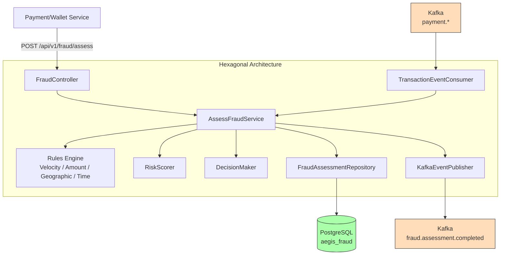
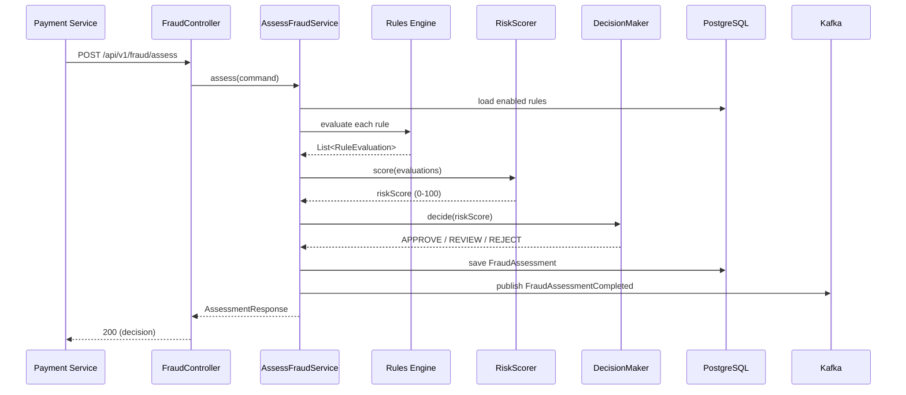

# Fraud Service

**Purpose**: Real-time fraud detection engine evaluating transactions against configurable rules with risk scoring and approve/review/reject decisions.

## Hexagonal Structure

### Domain (`com.aegis.fraud.domain`)
- **Models**: `FraudAssessment`, `FraudDecision` (enum), `FraudRule`, `RuleEvaluation`
- **Events**: [[03 - Domain Events/FraudAssessmentCompleted\|FraudAssessmentCompleted]]
- **Exceptions**: `AssessmentNotFoundException`
- **Inbound Ports**: [[04 - Ports/inbound/AssessFraudUseCase\|AssessFraudUseCase]]
- **Outbound Ports**: `FraudRuleRepository`, `FraudAssessmentRepository`, `EventPublisher`

### Application (`com.aegis.fraud.application`)
- **Services**: `AssessFraudService`, `RiskScorer`, `DecisionMaker`
- **Rules Engine**: `FraudRuleEvaluator` (interface), `VelocityRuleEvaluator`, `AmountThresholdRuleEvaluator`, `GeographicRuleEvaluator`, `TimeBasedRuleEvaluator`
- **DTOs**: `AssessmentRequest`, `AssessmentResponse`

### Infrastructure (`com.aegis.fraud.infrastructure`)
- **Persistence**: `FraudRuleJpaEntity`, `FraudAssessmentJpaEntity`, repository adapters
- **Messaging**: `KafkaEventPublisher`, `TransactionEventConsumer`
- **Config**: `KafkaConfig`, `SecurityConfig`

### Web (`com.aegis.fraud.web`)
- **Controllers**: `FraudController`
- **Advice**: `FraudExceptionHandler`

## API Endpoints

| Method | Path | Description |
|--------|------|-------------|
| POST | `/api/v1/fraud/assess` | Synchronous fraud assessment (score + decision) |
| GET | `/api/v1/fraud/assessments/{id}` | Retrieve stored assessment details |

## Business Rules

1. Risk score 0-100 (weighted rule aggregation, capped at 100)
2. Score < 30 → **APPROVE**
3. Score 30-70 → **REVIEW**
4. Score > 70 → **REJECT**
5. Rules are DB-configurable (see ADR-001 in `docs/adr/ADR-001-fraud-rules-configuration.md`)

## Events

| Direction | Event | Topic |
|-----------|-------|-------|
| Produced | [[03 - Domain Events/FraudAssessmentCompleted\|FraudAssessmentCompleted]] | `fraud.assessment.completed` |
| Consumed | TransferRequested | `payment.transfer.requested` |

## Dependencies

- **Depends on**: [[01 - Services/Common Module\|Common Module]], PostgreSQL, Kafka
- **Consumed by**: [[01 - Services/Audit Service\|Audit Service]] (via `fraud.assessment.completed`)

## Flyway Migrations

| File | Description |
|------|-------------|
| `V1__create_fraud_tables.sql` | Fraud rules + assessments (with seeded default rules) |
