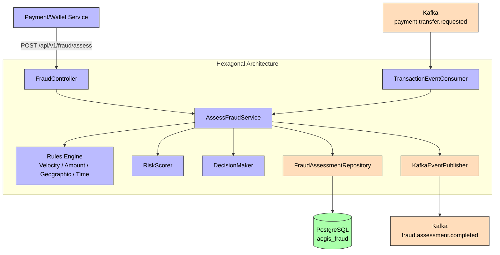
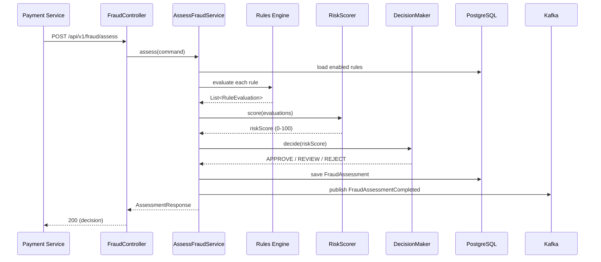

# Fraud Service

**Purpose**: Rule-based fraud detection engine (VELOCITY, AMOUNT, GEOGRAPHIC, TIME) that computes a risk score (0-100) and an APPROVE/REVIEW/REJECT decision. It consumes `payment.transfer.requested` and evaluates transactions via REST.

## Hexagonal Structure

### Domain (`com.aegis.fraud.domain`)
- **Models**: `FraudAssessment`, `FraudDecision` (APPROVE, REVIEW, REJECT), `FraudRule` (`RuleType`: VELOCITY, AMOUNT, GEOGRAPHIC, TIME), `RuleEvaluation`
- **Events**: [[03 - Domain Events/FraudAssessmentCompleted\|FraudAssessmentCompleted]]
- **Exceptions**: `AssessmentNotFoundException`
- **Inbound Ports**: [[04 - Ports/inbound/AssessFraudUseCase\|AssessFraudUseCase]]
- **Outbound Ports**: `FraudRuleRepository`, `FraudAssessmentRepository`, [[04 - Ports/outbound/EventPublisher\|EventPublisher]]

### Application (`com.aegis.fraud.application`)
- **Services**: `AssessFraudService`, `RiskScorer`, `DecisionMaker`
- **Rules Engine**: `FraudRuleEvaluator` (interface), `VelocityRuleEvaluator`, `AmountThresholdRuleEvaluator`, `GeographicRuleEvaluator`, `TimeBasedRuleEvaluator`, `TransactionContext`
- **DTOs**: `AssessmentRequest`, `AssessmentResponse`

### Infrastructure (`com.aegis.fraud.infrastructure`)
- **Persistence**: `FraudRuleJpaEntity`, `FraudAssessmentJpaEntity`, `ProcessedEventJpaRepository`, repository adapters
- **Messaging**: `KafkaEventPublisher`, `TransactionEventConsumer`
- **Config**: `KafkaConfig`, `SecurityConfig`

### Web (`com.aegis.fraud.web`)
- **Controllers**: `FraudController`
- **Advice**: `FraudExceptionHandler`

## API Endpoints

| Method | Path | Description |
|--------|------|-------------|
| POST | `/api/v1/fraud/assess` | Synchronous fraud assessment (score + decision) |
| GET | `/api/v1/fraud/assessments/{assessmentId}` | Retrieve stored assessment details |

## Business Rules

1. Risk score 0-100 (weighted rule aggregation, capped at 100)
2. Score < `review-threshold` (30) → **APPROVE**
3. Score > `reject-threshold` (70) → **REJECT**
4. Otherwise → **REVIEW**
5. Thresholds are configurable (`aegis.fraud.review-threshold`, `aegis.fraud.reject-threshold`)
6. Rules are DB-configurable and seeded at startup (see ADR-001 in `docs/adr/ADR-001-fraud-rules-configuration.md`)

## Events

| Direction | Event | Topic |
|-----------|-------|-------|
| Produced | [[03 - Domain Events/FraudAssessmentCompleted\|FraudAssessmentCompleted]] | `fraud.assessment.completed` |
| Consumed | `TransferRequested` | `payment.transfer.requested` |

## Dependencies

- **Depends on**: [[01 - Services/Common Module\|Common Module]], PostgreSQL, Kafka
- **Consumed by**: [[01 - Services/Audit Service\|Audit Service]] (via `fraud.assessment.completed`)

## Flyway Migrations

| File | Description |
|------|-------------|
| `V1__create_fraud_tables.sql` | Fraud rules + assessments (seeded with 4 default rules) |
| `V2__create_outbox_events.sql` | Outbox table |
| `V3__create_processed_events_table.sql` | Processed events (idempotency) |
