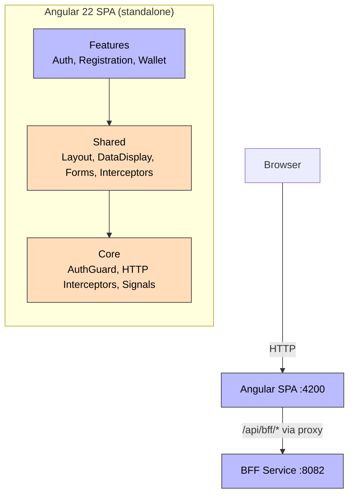
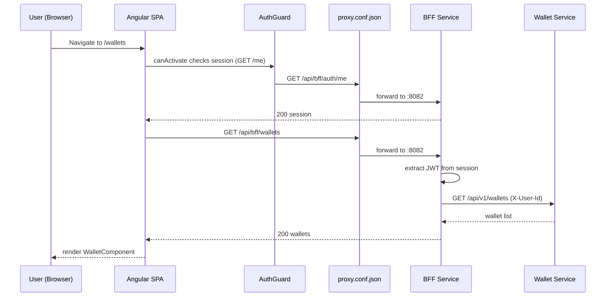

# Frontend

**Purpose**: Angular 22 SPA with Material Design — the user-facing interface for the Aegis platform. It exposes three real features (auth, registration, wallet) and guards the rest as placeholder routes.

## Tech Stack

| Technology | Version |
|------------|---------|
| Angular | 22 |
| Angular Material | 22 |
| TypeScript | 6 |
| State management | Angular Signals (no NgRx) |
| Build | Standalone components, lazy loading |

## Architecture

### Features (real)
- **Auth** — Login with email/password against the BFF session API
- **Registration** — New user sign-up
- **Wallet** — Wallet list, create, detail, balance adjust, deposits

### Placeholder routes
`payments`, `transactions`, `payouts`, `currencies`, `fraud`, `alerts`, `health`, `settings`, `users`, `api-keys` — all render the shared `PagePlaceholderComponent`. There is **no `/dashboard`** route.

### Shared Modules
- **Layout**: `AppShellComponent`, `HeaderComponent`, `SidebarComponent`, `PagePlaceholderComponent`
- **Data Display**: `StatCardComponent`, `StatusChipComponent`, `LoadingSkeletonComponent`, `EmptyStateComponent`
- **Forms**: `FormFieldErrorComponent`, `LoadingButtonComponent`, `PasswordInputComponent`
- **Components**: `ToastContainerComponent`, `ConfirmationDialogComponent`, `CommandPaletteComponent`, `KeyboardShortcutCheatSheetComponent`
- **Guards**: `AuthGuard` — protects `/wallets` and redirects to `/login` when the session is invalid
- **Interceptors**: `http-timeout` (15s timeout), `http-auth` (auth header stub), `http-error` (toast + redirect to `/login` on 401)
- **Services**: `ToastService`, `ConfirmationService`, `CommandPaletteService`, `KeyboardShortcutsService`

### Mock Login
`MockLoginService` is enabled via `environment.enableMockLogin` (dev only) and posts to `/api/bff/auth/mock-login`.

## Routes

| Path | Component | Auth |
|------|-----------|------|
| `/login` | `AuthComponent` | ❌ |
| `/register` | `RegistrationComponent` | ❌ |
| `/wallets` | `WalletComponent` | ✅ |
| `/payments`, `/transactions`, `/payouts`, `/currencies`, `/fraud`, `/alerts`, `/health`, `/settings`, `/users`, `/api-keys` | `PagePlaceholderComponent` | ✅ |

## Dependencies

- **Depends on**: [[01 - Services/BFF Service\|BFF Service]] (all API calls go through BFF)
- **Proxy**: `proxy.conf.json` routes `/api/bff/*` → BFF `:8082` (and `/api/*` → Identity `:8081`)
