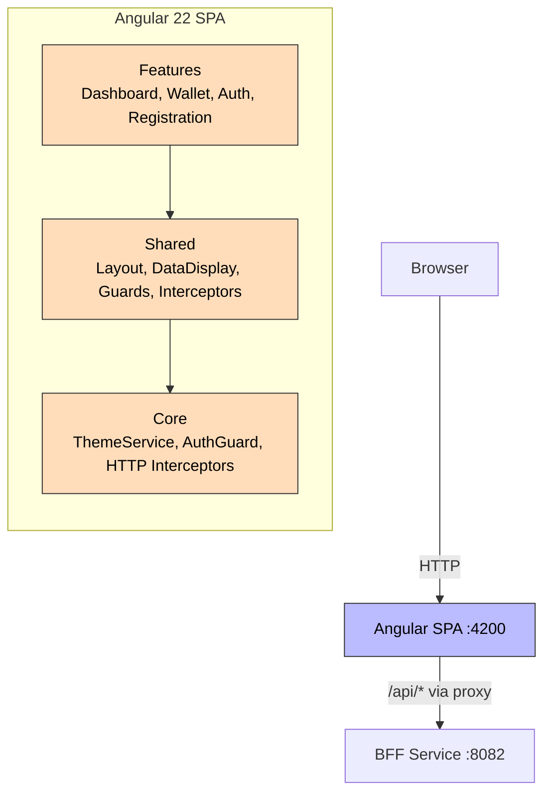
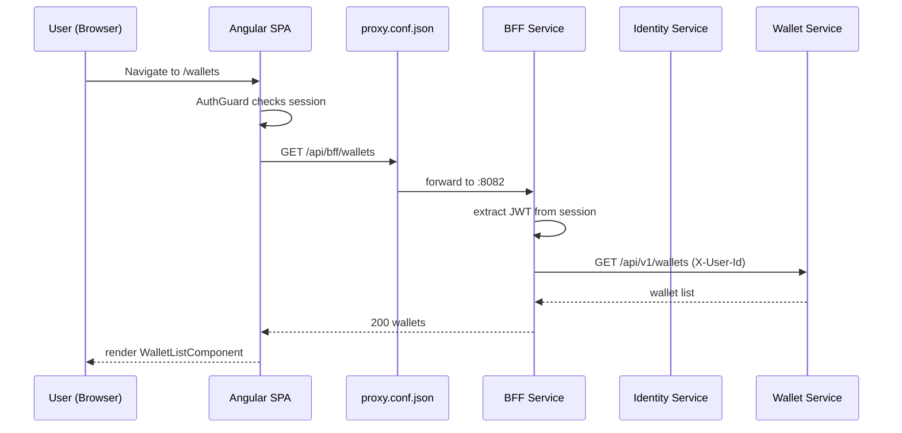

# Frontend

**Purpose**: Angular 22 SPA with Material Design — the user-facing interface for the Aegis platform.

## Tech Stack

| Technology | Version |
|------------|---------|
| Angular | 22 |
| Angular Material | 22 |
| TypeScript | 6 |
| Reactive Forms | — |
| Chart.js / ng2-charts | Dashboard |
| Design Tokens | Custom SCSS |

## Architecture

### Features
- **Dashboard** — KPI cards, charts, activity feed, system health
- **Wallet List** — Stripe-style table with status badges, CRUD actions
- **Wallet Detail** — Overview, balance cards, transaction history, timeline, analytics
- **Auth** — Login, registration, profile
- **Layout** — Sidebar navigation, header, theme toggle

### Core Modules
- `AppShellComponent` — Layout wrapper with sidebar + header
- `ThemeService` — Dark/light mode with design tokens
- `AuthGuard` — Route protection
- HTTP interceptors — Auth token injection + error handling

### Shared Components (UX Foundation)
- `StatCardComponent` — KPI metric cards
- `StatusChipComponent` — Colored status badges
- `LoadingSkeletonComponent` — Skeleton loaders
- `EmptyStateComponent` — Empty state display
- `AegisIconComponent` — Custom SVG icons

### Design System
- Gold (#D4AF37) brand palette
- Design tokens: colors, typography, spacing, radius, shadows
- Dark/light theme support
- WCAG 2.1 AA compliant

## Routes

| Path | Component | Auth |
|------|-----------|------|
| `/dashboard` | DashboardComponent | ✅ |
| `/wallets` | WalletListComponent | ✅ |
| `/wallets/:id` | WalletDetailComponent | ✅ |
| `/login` | AuthComponent | ❌ |
| `/register` | RegistrationComponent | ❌ |

## Dependencies

- **Depends on**: [[01 - Services/BFF Service\|BFF Service]] (all API calls)
- **Proxy**: `proxy.conf.json` routes `/api/*` → BFF `:8082`
