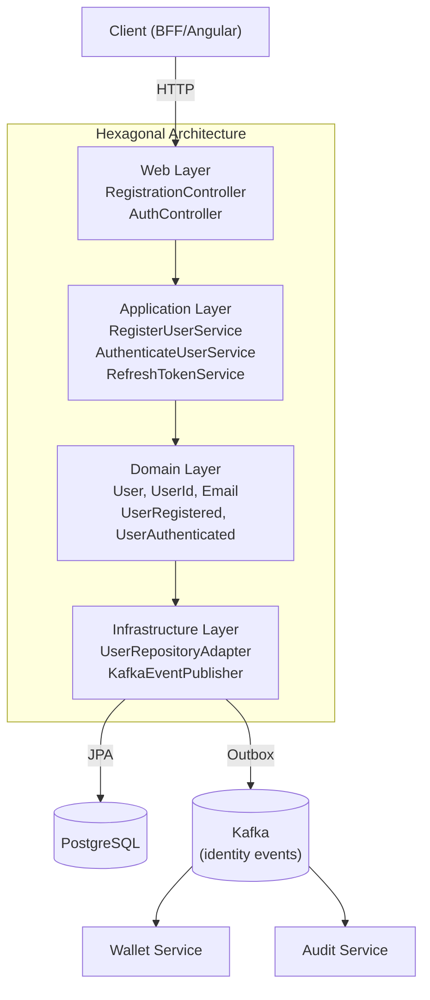
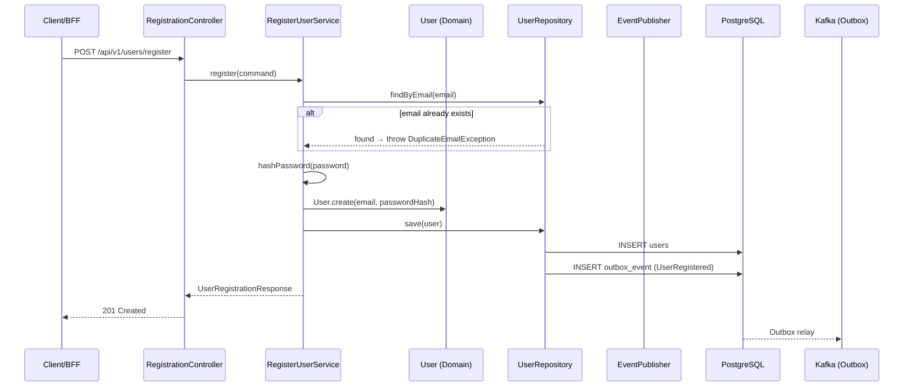

# Identity Service

**Purpose**: User registration, authentication, account management.

## Hexagonal Structure

### Domain (`com.aegis.identity.domain`)
- **Models**: [[02 - Domain Models/User\|User]], [[02 - Domain Models/UserId\|UserId]], [[02 - Domain Models/Email\|Email]], [[02 - Domain Models/PasswordHash\|PasswordHash]], [[02 - Domain Models/UserStatus\|UserStatus]], [[02 - Domain Models/Credentials\|Credentials]], [[02 - Domain Models/TokenPair\|TokenPair]]
- **Events**: [[03 - Domain Events/UserRegistered\|UserRegistered]], [[03 - Domain Events/UserAuthenticated\|UserAuthenticated]], [[03 - Domain Events/UserAccountLocked\|UserAccountLocked]]
- **Exceptions**: `DuplicateEmailException`, `InvalidEmailException`, `WeakPasswordException`, `InvalidRegistrationException`, `InvalidCredentialsException`, `AccountLockedException`, `AccountSuspendedException`
- **Inbound Ports**: [[04 - Ports/inbound/RegisterUserUseCase\|RegisterUserUseCase]], [[04 - Ports/inbound/AuthenticateUserUseCase\|AuthenticateUserUseCase]], `RefreshTokenUseCase`
- **Outbound Ports**: [[04 - Ports/outbound/UserRepository\|UserRepository]], [[04 - Ports/outbound/PasswordHasher\|PasswordHasher]], [[04 - Ports/outbound/TokenProvider\|TokenProvider]], [[04 - Ports/outbound/EventPublisher\|EventPublisher]]

### Application (`com.aegis.identity.application`)
- **Services**: `RegisterUserService`, `AuthenticateUserService`, `RefreshTokenService`
- **DTOs**: `RegisterUserCommand`, `UserRegistrationResponse`, `AuthenticateUserCommand`, `AuthenticationResponse`
- **Mappers**: `UserMapper`, `AuthMapper`

### Infrastructure (`com.aegis.identity.infrastructure`)
- **Persistence**: `UserJpaEntity`, `UserJpaRepository`, `UserRepositoryAdapter`, `OutboxEventJpaEntity`, `OutboxEventJpaRepository`, `OutboxRelayScheduler`
- **Security**: `BCryptPasswordHasher`, `JwtTokenProvider`, `JwtAuthenticationFilter`
- **Messaging**: `KafkaEventPublisher`
- **Config**: `SecurityConfig`, `KafkaConfig`, `SwaggerConfig`

### Web (`com.aegis.identity.web`)
- **Controllers**: `RegistrationController`, `AuthController`
- **DTOs**: `RegisterUserRequest`, `LoginRequest`, `RefreshTokenRequest`
- **Advice**: `RegistrationExceptionHandler`, `AuthExceptionHandler`

## API Endpoints

| Method | Path | Description |
|--------|------|-------------|
| POST | `/api/v1/users/register` | Register new user |
| POST | `/api/v1/auth/login` | Login |
| POST | `/api/v1/auth/refresh` | Refresh tokens |

## Domain Events Produced

| Event | Topic |
|-------|-------|
| [[03 - Domain Events/UserRegistered\|UserRegistered]] | `aegis.identity.user-registered` |
| [[03 - Domain Events/UserAuthenticated\|UserAuthenticated]] | `aegis.identity.user-authenticated` |
| [[03 - Domain Events/UserAccountLocked\|UserAccountLocked]] | `aegis.identity.user-account-locked` |

## Dependencies

- **Depends on**: [[01 - Services/Common Module\|Common Module]], PostgreSQL, Kafka
- **Depended by**: [[01 - Services/BFF Service\|BFF Service]] (proxies auth)
- **Consumed by**: [[01 - Services/Frontend\|Frontend]] via BFF

## Flyway Migrations

| File | Description |
|------|-------------|
| `V1__create_users_and_outbox_tables.sql` | Initial schema |
| `V2__add_auth_fields_to_users.sql` | Failed attempts + lockout |
