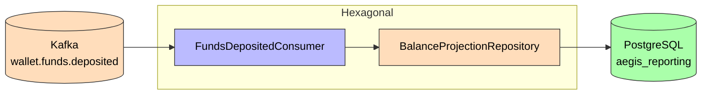
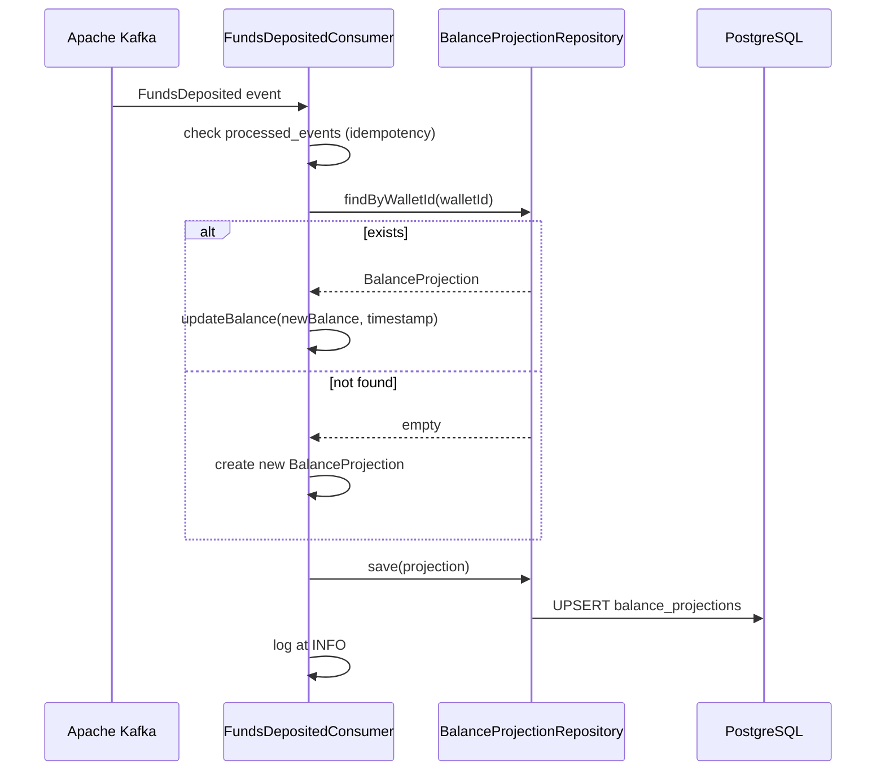

# Reporting Service

**Purpose**: Consumes domain events to maintain a denormalized read-model. It upserts a `BalanceProjection` per wallet from `wallet.funds.deposited` events. **Passive service** — it has no REST endpoints and produces no events.

## Hexagonal Structure

### Domain (`com.aegis.reporting.domain`)
- **Events**: `FundsDepositedEvent` (local copy for Kafka deserialization)
- **Models**: `BalanceProjection` (read-model)

### Infrastructure (`com.aegis.reporting.infrastructure`)
- **Persistence**: `BalanceProjectionRepository`, `ProcessedEventJpaRepository`
- **Messaging**: `FundsDepositedConsumer`
- **Config**: `KafkaConfig`

## Event Consumers

| Event | Topic | Handler | Action |
|-------|-------|---------|--------|
| [[03 - Domain Events/FundsDeposited\|FundsDeposited]] | `wallet.funds.deposited` | `FundsDepositedConsumer` | Upserts `BalanceProjection` by walletId |

Consumption is idempotent via the `processed_events` table (deduplication by event ID).

## Dependencies

- **Depends on**: [[01 - Services/Common Module\|Common Module]], PostgreSQL, Kafka
- **Consumes from**: [[01 - Services/Wallet Service\|Wallet Service]] (via `wallet.funds.deposited`)

## Flyway Migrations

| File | Description |
|------|-------------|
| `V1__create_balance_projection_table.sql` | Balance projections |
| `V2__create_processed_events_table.sql` | Processed events (idempotency) |
