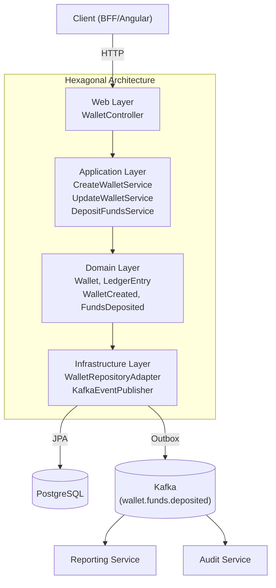
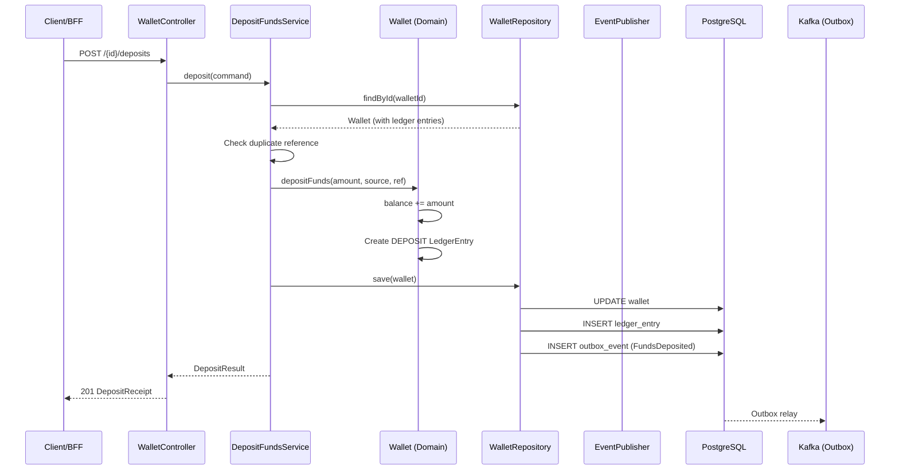

# Wallet Service

**Purpose**: Wallet lifecycle management — create, deposit, adjust balance, deactivate, with full ledger tracking.

## Deposit Flow

## Hexagonal Structure

### Domain (`com.aegis.wallet.domain`)
- **Models**: [[02 - Domain Models/Wallet\|Wallet]], [[02 - Domain Models/WalletId\|WalletId]], [[02 - Domain Models/WalletStatus\|WalletStatus]], [[02 - Domain Models/LedgerEntry\|LedgerEntry]], [[02 - Domain Models/LedgerEntryType\|LedgerEntryType]]
- **Events**: [[03 - Domain Events/WalletCreated\|WalletCreated]], [[03 - Domain Events/WalletBalanceAdjusted\|WalletBalanceAdjusted]], [[03 - Domain Events/FundsDeposited\|FundsDeposited]], [[03 - Domain Events/WalletDeactivated\|WalletDeactivated]]
- **Exceptions**: `WalletNotFoundException`, `WalletLimitExceededException`, `InvalidCurrencyException`, `WalletOperationNotAllowedException`, `DuplicateDepositException`
- **Inbound Ports**: [[04 - Ports/inbound/CreateWalletUseCase\|CreateWalletUseCase]], [[04 - Ports/inbound/UpdateWalletUseCase\|UpdateWalletUseCase]], [[04 - Ports/inbound/DepositFundsUseCase\|DepositFundsUseCase]]
- **Outbound Ports**: [[04 - Ports/outbound/WalletRepository\|WalletRepository]], [[04 - Ports/outbound/EventPublisher\|EventPublisher]]

### Application (`com.aegis.wallet.application`)
- **Services**: `CreateWalletService`, `UpdateWalletService`, `DepositFundsService`
- **DTOs**: `CreateWalletCommand`, `WalletResponse`, `AdjustBalanceCommand`, `UpdateStatusCommand`, `WalletDetailResponse`, `DepositFundsCommand`, `DepositReceipt`
- **Mappers**: `WalletMapper`

### Infrastructure (`com.aegis.wallet.infrastructure`)
- **Persistence**: `WalletJpaEntity`, `WalletJpaRepository`, `WalletRepositoryAdapter`, `LedgerEntryJpaEntity`, `LedgerEntryJpaRepository`, `OutboxEventJpaEntity`, `OutboxEventJpaRepository`, `OutboxRelayScheduler`
- **Messaging**: `KafkaEventPublisher`
- **Config**: `SecurityConfig`, `KafkaConfig`, `SwaggerConfig`

### Web (`com.aegis.wallet.web`)
- **Controllers**: `WalletController`
- **Advice**: `WalletExceptionHandler`

## API Endpoints

| Method | Path | Description |
|--------|------|-------------|
| POST | `/api/v1/wallets` | Create wallet |
| GET | `/api/v1/wallets` | List wallets |
| GET | `/api/v1/wallets/{id}` | Get wallet by ID (includes premium flag) |
| POST | `/api/v1/wallets/{id}/deposits` | Deposit funds (with source tracking) |
| PATCH | `/api/v1/wallets/{id}/balance` | Adjust balance (deposit positive, withdraw negative) |
| PATCH | `/api/v1/wallets/{id}/status` | Update wallet status (FROZEN, CLOSED) |

## Business Rules

1. Max 5 wallets per user (configurable)
2. Cannot deactivate with non-zero balance
3. Wallet must be ACTIVE to deposit or adjust balance
4. Deposit reference must be unique (idempotency)
5. Premium flag when balance > 1000 EUR

## Domain Events Produced

| Event | Topic |
|-------|-------|
| [[03 - Domain Events/WalletCreated\|WalletCreated]] | `aegis.wallet.wallet-created` |
| [[03 - Domain Events/WalletBalanceAdjusted\|WalletBalanceAdjusted]] | `aegis.wallet.balance.adjusted` |
| [[03 - Domain Events/FundsDeposited\|FundsDeposited]] | `wallet.funds.deposited` |

## Dependencies

- **Depends on**: [[01 - Services/Common Module\|Common Module]], PostgreSQL, Kafka
- **Depended by**: [[01 - Services/BFF Service\|BFF Service]] (proxies wallet API)
- **Consumed by**: [[01 - Services/Reporting Service\|Reporting Service]], [[01 - Services/Audit Service\|Audit Service]] (via `wallet.funds.deposited`)

## Flyway Migrations

| File | Description |
|------|-------------|
| `V1__create_wallet_tables.sql` | Wallets + ledger + outbox |
