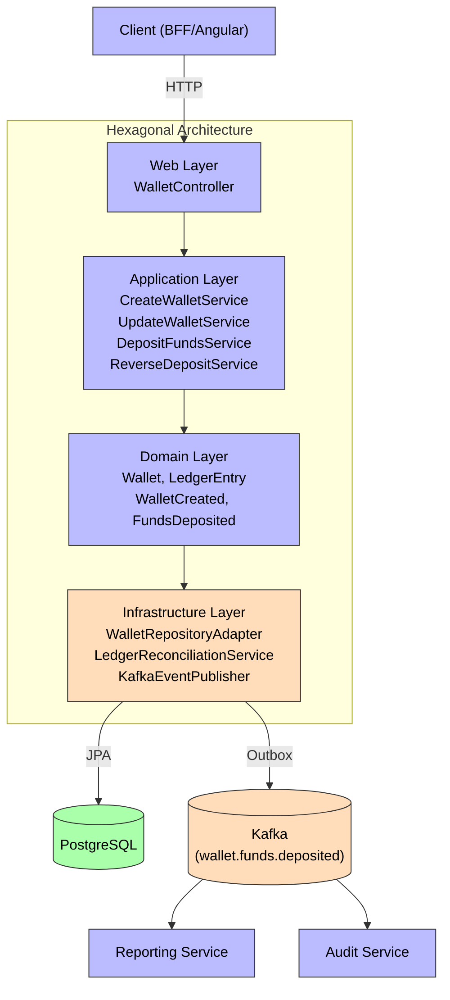
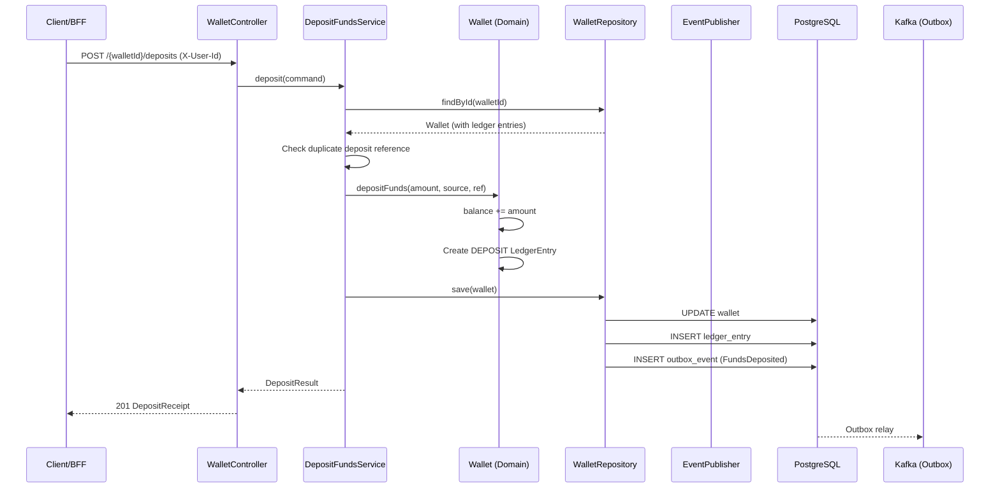

# Wallet Service

**Purpose**: Wallet lifecycle management — create (max 5 per user), list, detail, idempotent deposits, balance adjustment, status change (FROZEN/CLOSED), and deposit reversal, with full ledger tracking.

## Deposit Flow

## Hexagonal Structure

### Domain (`com.aegis.wallet.domain`)
- **Models**: [[02 - Domain Models/Wallet\|Wallet]], [[02 - Domain Models/WalletId\|WalletId]], [[02 - Domain Models/WalletStatus\|WalletStatus]], [[02 - Domain Models/LedgerEntry\|LedgerEntry]], [[02 - Domain Models/LedgerEntryType\|LedgerEntryType]]
- **Events**: [[03 - Domain Events/WalletCreated\|WalletCreated]], [[03 - Domain Events/WalletBalanceAdjusted\|WalletBalanceAdjusted]], [[03 - Domain Events/FundsDeposited\|FundsDeposited]]
- **Exceptions**: `WalletNotFoundException`, `WalletLimitExceededException`, `InvalidCurrencyException`, `WalletOperationNotAllowedException`, `DuplicateDepositException`, `DepositReversalException`, `InsufficientFundsException`
- **Inbound Ports**: [[04 - Ports/inbound/CreateWalletUseCase\|CreateWalletUseCase]], [[04 - Ports/inbound/DepositFundsUseCase\|DepositFundsUseCase]], [[04 - Ports/inbound/UpdateWalletUseCase\|UpdateWalletUseCase]], `ReverseDepositUseCase`, `ListWalletsUseCase`, `GetWalletDetailUseCase`
- **Outbound Ports**: [[04 - Ports/outbound/WalletRepository\|WalletRepository]], [[04 - Ports/outbound/EventPublisher\|EventPublisher]]

### Application (`com.aegis.wallet.application`)
- **Services**: `CreateWalletService`, `UpdateWalletService`, `DepositFundsService`, `ReverseDepositService`, `WalletQueryService`
- **DTOs**: `CreateWalletCommand`, `WalletResponse`, `WalletDetailResponse`, `DepositFundsCommand`, `DepositReceipt`, `ReversalReceipt`

### Infrastructure (`com.aegis.wallet.infrastructure`)
- **Persistence**: `WalletJpaEntity`, `WalletJpaRepository`, `WalletRepositoryAdapter`, `LedgerEntryJpaEntity`, `LedgerEntryJpaRepository`, `OutboxEventJpaEntity`, `OutboxEventJpaRepository`, `OutboxRelayScheduler`
- **Reconciliation**: `LedgerReconciliationService` (job every 60s, gauge `aegis.wallet.reconciliation_discrepancies`)
- **Messaging**: `KafkaEventPublisher`
- **Config**: `SecurityConfig`, `KafkaConfig`

### Web (`com.aegis.wallet.web`)
- **Controllers**: `WalletController`
- **DTOs**: `CreateWalletRequest`, `DepositFundsRequest`, `ReversalRequest`, `AdjustBalanceRequest`, `UpdateStatusRequest`
- **Advice**: `WalletExceptionHandler`

## API Endpoints

All endpoints require the `X-User-Id` header.

| Method | Path | Description |
|--------|------|-------------|
| POST | `/api/v1/wallets` | Create wallet (201) |
| GET | `/api/v1/wallets` | List wallets |
| GET | `/api/v1/wallets/{walletId}` | Get wallet by ID |
| PATCH | `/api/v1/wallets/{walletId}/balance` | Adjust balance (positive deposit, negative withdraw) |
| POST | `/api/v1/wallets/{walletId}/deposits` | Deposit funds, idempotent by reference (201) |
| POST | `/api/v1/wallets/{walletId}/deposits/{depositId}/reversal` | Reverse a deposit (REVERSAL ledger entry) |
| PATCH | `/api/v1/wallets/{walletId}/status` | Update wallet status (FROZEN, CLOSED) |

## Business Rules

1. Max 5 wallets per user (configurable)
2. Wallet must be ACTIVE to deposit or adjust balance
3. Deposit reference must be unique (idempotency)
4. Status can change to FROZEN or CLOSED; no event is emitted on status change
5. Deposit reversal posts a REVERSAL ledger entry (ADR-004); no event is emitted
6. Ledger reconciliation job (60s) flags balance vs. ledger discrepancies via the `aegis.wallet.reconciliation_discrepancies` gauge

## Domain Events Produced

| Event | Topic |
|-------|-------|
| [[03 - Domain Events/WalletCreated\|WalletCreated]] | `aegis.wallet.created` |
| [[03 - Domain Events/WalletBalanceAdjusted\|WalletBalanceAdjusted]] | `aegis.wallet.balance.adjusted` |
| [[03 - Domain Events/FundsDeposited\|FundsDeposited]] | `wallet.funds.deposited` |

## Dependencies

- **Depends on**: [[01 - Services/Common Module\|Common Module]], PostgreSQL, Kafka
- **Depended by**: [[01 - Services/BFF Service\|BFF Service]] (proxies wallet API)
- **Consumed by**: [[01 - Services/Reporting Service\|Reporting Service]], [[01 - Services/Audit Service\|Audit Service]] (via `wallet.funds.deposited`)

## Flyway Migrations

| File | Description |
|------|-------------|
| `V1__create_wallet_tables.sql` | Wallets + ledger + outbox |
| `V2__add_outbox_lock_index.sql` | Outbox lock index |
| `V3__unique_deposit_reference.sql` | Unique deposit reference (idempotency) |
| `V4__add_ledger_reversal.sql` | Reversal ledger support |
