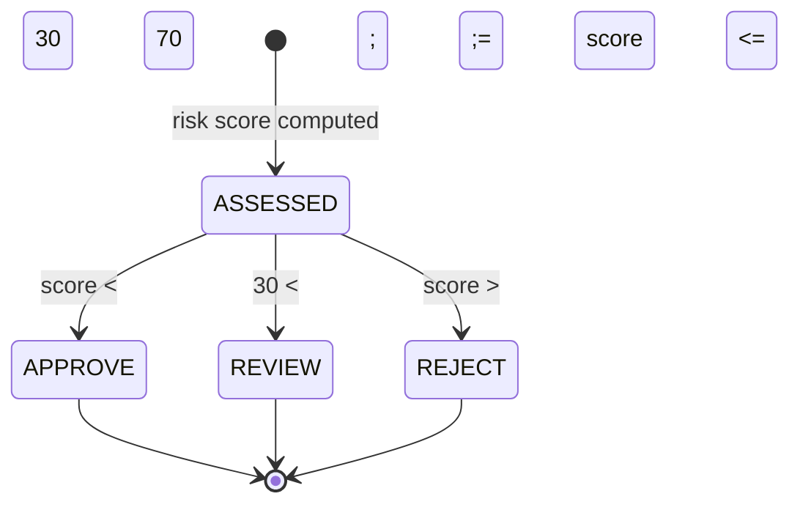

# FraudDecision

Enum representing the outcome of a fraud assessment.

## Values

| Value | Risk Score Band | Description |
|-------|-----------------|-------------|
| `APPROVE` | < 30 | Transaction cleared |
| `REVIEW` | 30 - 70 | Flagged for manual review |
| `REJECT` | > 70 | Transaction blocked |

## Decision Flow

## Used By

- [[02 - Domain Models/FraudAssessment\|FraudAssessment]] aggregate root
- [[03 - Domain Events/FraudAssessmentCompleted\|FraudAssessmentCompleted]] event schema
