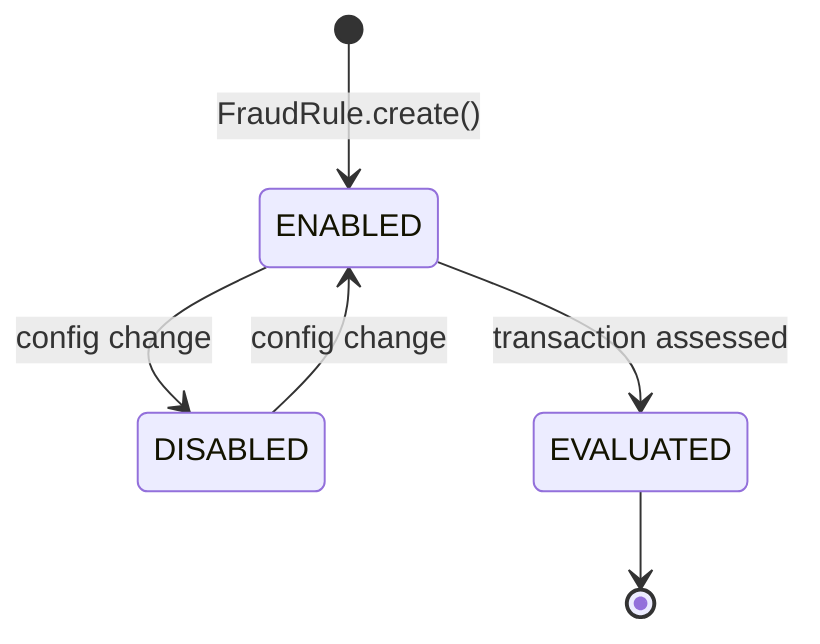

# FraudRule

Value object describing a configurable fraud detection rule.

## Fields

| Field | Type | Description |
|-------|------|-------------|
| `id` | UUID | Unique rule identifier (UUID v7) |
| `name` | String | Rule name |
| `type` | RuleType | Rule category |
| `threshold` | int | Trigger threshold |
| `weight` | int | Weight applied to the composite score |
| `enabled` | boolean | Whether the rule participates in assessments |

## RuleType

| Value | Description |
|-------|-------------|
| `VELOCITY` | Limits on transaction frequency |
| `AMOUNT` | Limits on transaction amount |
| `GEOGRAPHIC` | Country / region checks |
| `TIME` | Time-of-day or date checks |

## Lifecycle

## Factory Methods

- `FraudRule.create(name, type, threshold, weight)` → enabled rule

## Used By

- Evaluated to build [[02 - Domain Models/RuleEvaluation\|RuleEvaluation]] entries
- Loaded via [[04 - Ports/outbound/FraudRuleRepository\|FraudRuleRepository]] (enabled rules only)
