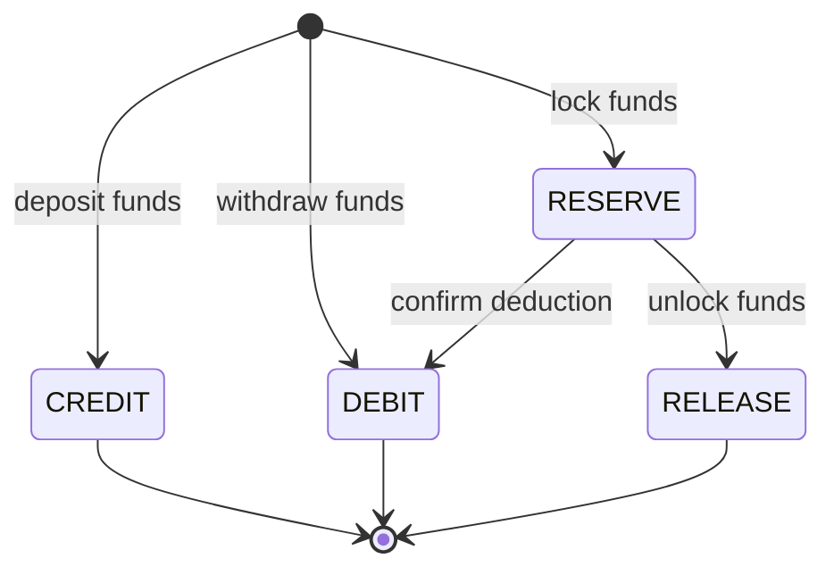

# LedgerEntryType

Enum classifying ledger transaction types.

## Values

| Value | Effect | Description |
|-------|--------|-------------|
| `CREDIT` | +balance | Funds added |
| `DEBIT` | -balance | Funds deducted |
| `RESERVE` | -available | Funds locked |
| `RELEASE` | +available | Funds unlocked |

## State Transitions

Ledger entry types represent immutable transaction classifications. Each entry is created once with a fixed type. The "transitions" below represent the logical flow of funds through the wallet lifecycle:

## Used By

- [[02 - Domain Models/LedgerEntry\|LedgerEntry]] value object
