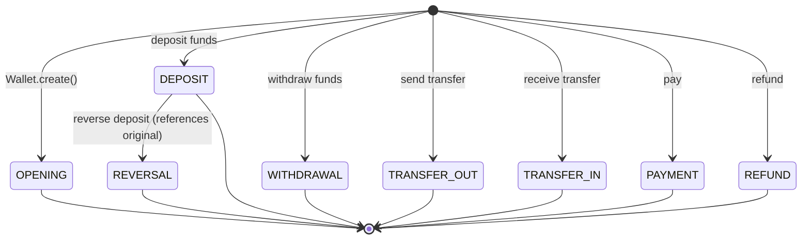

# LedgerEntryType

Enum classifying immutable ledger entry types.

## Values

| Value | Effect | Description |
|-------|--------|-------------|
| `OPENING` | +0 | Wallet creation entry |
| `DEPOSIT` | +balance | Funds added |
| `WITHDRAWAL` | -balance | Funds deducted |
| `TRANSFER_OUT` | -balance | Funds sent to another wallet |
| `TRANSFER_IN` | +balance | Funds received from another wallet |
| `PAYMENT` | -balance | Funds paid out |
| `REFUND` | +balance | Funds refunded |
| `REVERSAL` | -balance | Reverses a DEPOSIT (references original entry) |

## State Transitions

Ledger entry types represent immutable transaction classifications. Each entry is created once with a fixed type. The "transitions" below represent the logical flow of funds through the wallet lifecycle:

## Used By

- [[02 - Domain Models/LedgerEntry\|LedgerEntry]] value object
