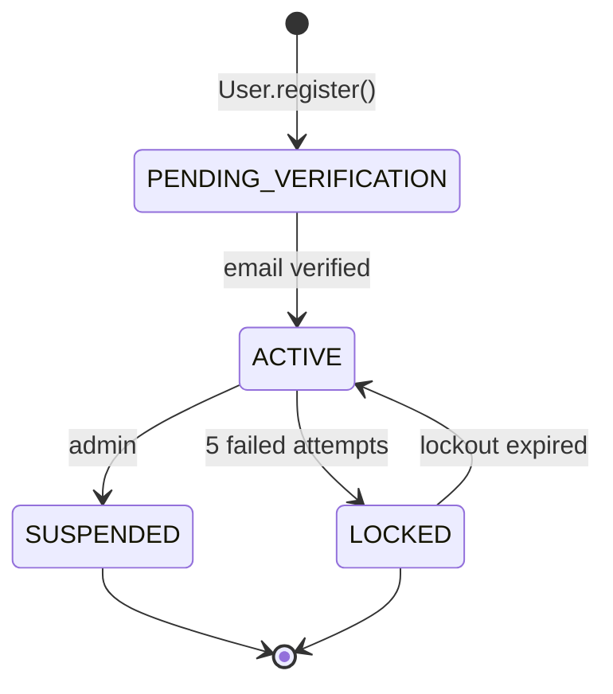

# UserStatus

Enum representing account lifecycle states.

## Values

| Value | Description |
|-------|-------------|
| `PENDING_VERIFICATION` | Awaiting email verification |
| `ACTIVE` | Fully registered and active |
| `LOCKED` | Temporarily locked (5 failed attempts, 15 min) |
| `SUSPENDED` | Admin-suspended |

## State Transitions

## Used By

- [[02 - Domain Models/User\|User]] aggregate root
