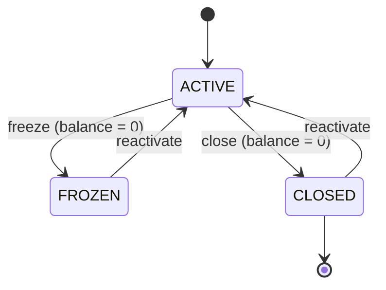

# WalletStatus

Enum representing wallet lifecycle states.

## Values

| Value | Color | Description |
|-------|-------|-------------|
| `ACTIVE` | 🟢 Green | Fully operational |
| `FROZEN` | 🔵 Blue | Temporarily frozen |
| `CLOSED` | ⚫ Grey | Deactivated |

## State Transitions

## Used By

- [[02 - Domain Models/Wallet\|Wallet]] aggregate root
- Displayed via `StatusChipComponent` in frontend
