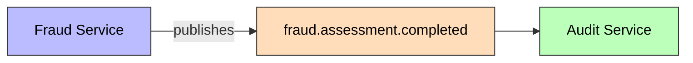
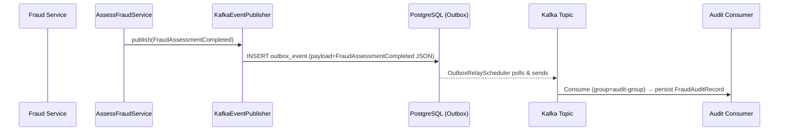

# FraudAssessmentCompleted

Published when a fraud assessment finishes for a transaction.

## Schema

| Field | Type | Description |
|-------|------|-------------|
| `eventId` | UUID | Unique event identifier |
| `eventType` | String | `FRAUD_ASSESSMENT_COMPLETED` |
| `schemaVersion` | String | `1.0` |
| `assessmentId` | UUID | Assessment's ID |
| `transactionId` | UUID | Assessed transaction's ID |
| `transactionType` | String | TRANSFER, PAYMENT, etc. |
| `riskScore` | int | Composite risk score 0-100 |
| `decision` | FraudDecision | APPROVE, REVIEW, REJECT |
| `rulesEvaluated` | List\<RuleEvaluation\> | Per-rule scores and details |
| `timestamp` | Instant | Assessment time |

## Details

- **Producer**: [[01 - Services/Fraud Service|Fraud Service]] via [[04 - Ports/outbound/EventPublisher|EventPublisher]]
- **Topic**: `fraud.assessment.completed` ([[05 - Infrastructure/Kafka Topics|Kafka Topics]])
- **Trigger**: `POST /api/v1/fraud/assess`
- **Consumed by**: [[01 - Services/Audit Service|Audit Service]] (persists [[02 - Domain Models/FraudAuditRecord|FraudAuditRecord]])
