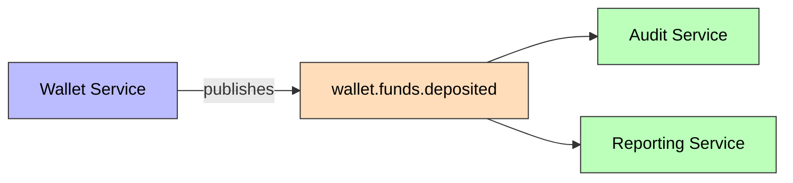
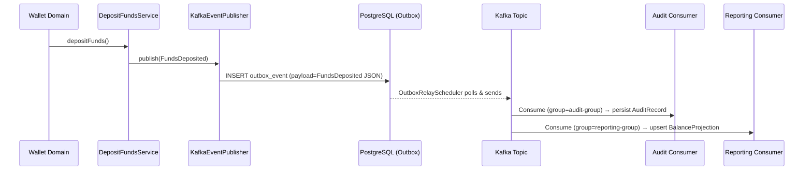

# FundsDeposited

Published when funds are deposited into a wallet via the dedicated deposit endpoint.

## Schema

| Field | Type | Description |
|-------|------|-------------|
| `eventId` | UUID | Unique event identifier |
| `eventType` | String | `FUNDS_DEPOSITED` |
| `schemaVersion` | String | `1.0` |
| `walletId` | UUID | Target wallet's ID |
| `userId` | UUID | Owner's ID |
| `amount` | BigDecimal | Deposited amount (positive) |
| `currency` | String | ISO 4217 currency |
| `source` | String | Source of funds (BANK_TRANSFER, CARD, etc.) |
| `reference` | String | External reference for idempotency |
| `newBalance` | BigDecimal | Wallet balance after deposit |
| `timestamp` | Instant | Event time |
| `correlationId` | String | Correlation ID for tracing |

## Details

- **Producer**: [[01 - Services/Wallet Service|Wallet Service]] via [[04 - Ports/outbound/EventPublisher|EventPublisher]]
- **Topic**: `wallet.funds.deposited` ([[05 - Infrastructure/Kafka Topics|Kafka Topics]])
- **Trigger**: `POST /api/v1/wallets/{id}/deposits`
- **Consumed by**: [[01 - Services/Audit Service|Audit Service]] (persists [[02 - Domain Models/AuditRecord|AuditRecord]]), [[01 - Services/Reporting Service|Reporting Service]] (persists [[02 - Domain Models/BalanceProjection|BalanceProjection]])
