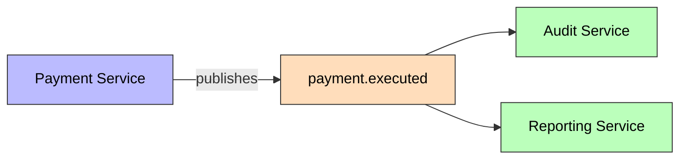
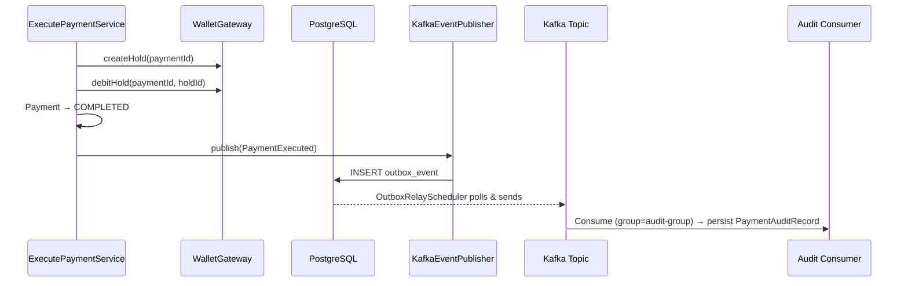

# PaymentExecuted

Published when a payment settles: the wallet is debited and the `Payment` aggregate reaches `COMPLETED`.

## Schema

| Field | Type | Description |
|-------|------|-------------|
| `eventId` | UUID | Unique event identifier |
| `eventType` | String | `PAYMENT_EXECUTED` |
| `schemaVersion` | String | `1.0` |
| `paymentId` | UUID | The payment's ID |
| `walletId` | UUID | Debited wallet |
| `userId` | UUID | Payer's ID |
| `amount` | BigDecimal | Payment amount |
| `currency` | String | ISO 4217 currency |
| `payee` | Object | `{name, id, type}` |
| `fraudAssessmentId` | UUID | Fraud assessment that authorized it |
| `holdId` | UUID | Settled hold |
| `newBalance` | BigDecimal | Wallet balance after payment |
| `reference` | String | Idempotency key |
| `timestamp` | Instant | Event time |
| `correlationId` | String | Correlation ID for tracing |

## Details

- **Producer**: [[01 - Services/Payment Service|Payment Service]] via [[04 - Ports/outbound/EventPublisher|EventPublisher]]
- **Topic**: `payment.executed` ([[05 - Infrastructure/Kafka Topics|Kafka Topics]])
- **Trigger**: successful `POST /api/v1/payments` (saga: fraud → hold → debit)
- **Consumed by**: [[01 - Services/Audit Service|Audit Service]] (persists [[02 - Domain Models/PaymentAuditRecord|PaymentAuditRecord]])
