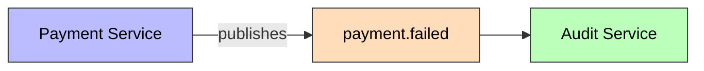
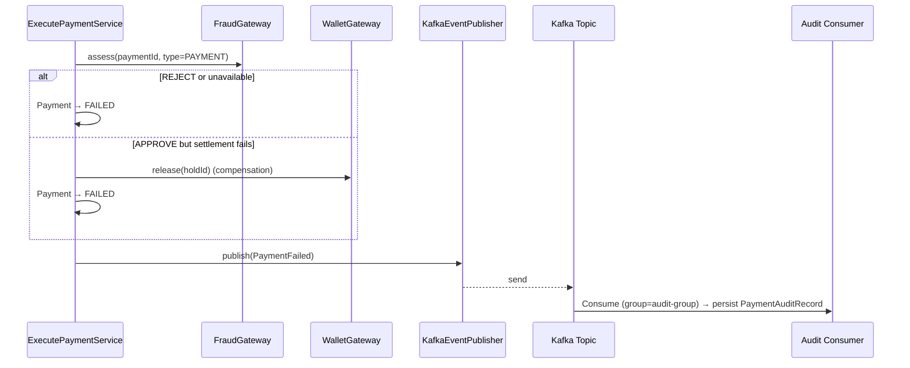

# PaymentFailed

Published when a payment fails — fraud rejection, insufficient funds, or a settlement failure (with compensation). The `Payment` aggregate reaches `FAILED`.

## Schema

| Field | Type | Description |
|-------|------|-------------|
| `eventId` | UUID | Unique event identifier |
| `eventType` | String | `PAYMENT_FAILED` |
| `schemaVersion` | String | `1.0` |
| `paymentId` | UUID | The payment's ID |
| `walletId` | UUID | Debit wallet |
| `userId` | UUID | Payer's ID |
| `amount` | BigDecimal | Payment amount |
| `currency` | String | ISO 4217 currency |
| `failureReason` | String | `FRAUD_REJECTED`, `INSUFFICIENT_FUNDS`, `SETTLEMENT_FAILED`, etc. |
| `failureDetails` | String | Human-readable detail (no sensitive data) |
| `compensated` | Boolean | True when a created hold was released |
| `reference` | String | Idempotency key |
| `timestamp` | Instant | Event time |
| `correlationId` | String | Correlation ID for tracing |

## Details

- **Producer**: [[01 - Services/Payment Service|Payment Service]] via [[04 - Ports/outbound/EventPublisher|EventPublisher]]
- **Topic**: `payment.failed` ([[05 - Infrastructure/Kafka Topics|Kafka Topics]])
- **Trigger**: rejected/insufficient/unavailable payment; settlement failure with compensation
- **Consumed by**: [[01 - Services/Audit Service|Audit Service]] (persists [[02 - Domain Models/PaymentAuditRecord|PaymentAuditRecord]])
