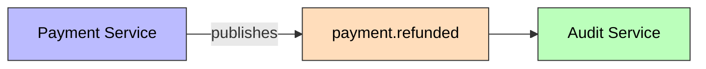

# PaymentRefunded

Published when a completed payment is refunded: the payer's wallet is credited with a `REFUND` ledger entry and the payment reaches `REFUNDED`.



```mermaid
sequenceDiagram
    participant Svc as RefundPaymentService
    participant Wallet as WalletGateway
    participant DB as PostgreSQL
    participant Pub as KafkaEventPublisher
    participant Kafka as Kafka Topic
    participant Audit as Audit Consumer

    Svc->>Svc: validate payment COMPLETED + owned + amount
    Svc->>Wallet: creditRefund(refundId)
    Wallet-->>Svc: newBalance
    Svc->>Svc: Refund → COMPLETED; Payment → REFUNDED
    Svc->>Pub: publish(PaymentRefunded)
    Pub->>DB: INSERT outbox_event
    DB-->>Kafka: OutboxRelayScheduler polls & sends
    Kafka->>Audit: Consume (group=audit-group) → persist RefundAuditRecord
```

## Schema

| Field | Type | Description |
|-------|------|-------------|
| `eventId` | UUID | Unique event identifier |
| `eventType` | String | `PAYMENT_REFUNDED` |
| `schemaVersion` | String | `1.0` |
| `refundId` | UUID | The refund's ID |
| `paymentId` | UUID | The refunded payment's ID |
| `walletId` | UUID | Credited wallet |
| `userId` | UUID | Refund recipient |
| `amount` | BigDecimal | Refund amount |
| `currency` | String | ISO 4217 currency |
| `reason` | String | Optional refund reason |
| `reference` | String | Idempotency key |
| `newBalance` | BigDecimal | Wallet balance after the credit |
| `timestamp` | Instant | Event time |
| `correlationId` | String | Correlation ID for tracing |

## Details

- **Producer**: [[01 - Services/Payment Service|Payment Service]] via [[04 - Ports/outbound/EventPublisher|EventPublisher]]
- **Topic**: `payment.refunded` ([[05 - Infrastructure/Kafka Topics|Kafka Topics]])
- **Trigger**: `POST /api/v1/payments/{paymentId}/refund` (saga: validate → credit → REFUNDED)
- **Consumed by**: [[01 - Services/Audit Service|Audit Service]] (persists [[02 - Domain Models/RefundAuditRecord|RefundAuditRecord]])
