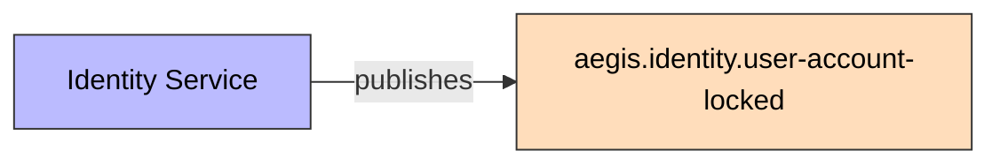
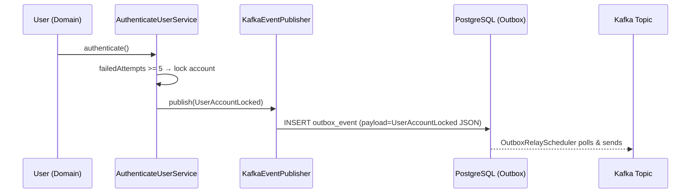

# UserAccountLocked

Published when a user account is locked after 5 failed login attempts.

## Schema

| Field | Type | Description |
|-------|------|-------------|
| `eventId` | UUID | Unique event identifier |
| `eventType` | String | `USER_ACCOUNT_LOCKED` |
| `schemaVersion` | String | `1.0` |
| `userId` | UUID | Locked user's ID |
| `email` | String | User's email |
| `timestamp` | Instant | Event time |
| `failureCount` | int | Total failed attempts |
| `correlationId` | String | Correlation ID for tracing |

## Details

- **Producer**: [[01 - Services/Identity Service|Identity Service]] via [[04 - Ports/outbound/EventPublisher|EventPublisher]]
- **Topic**: `aegis.identity.user-account-locked` ([[05 - Infrastructure/Kafka Topics|Kafka Topics]])
- **Trigger**: `User.authenticate()` when failed attempts reach 5

## Consumers

- Ninguno actualmente (sin consumidor configurado)
