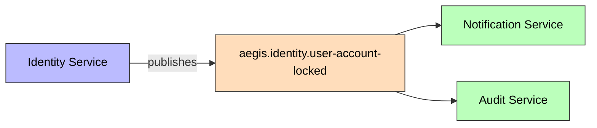
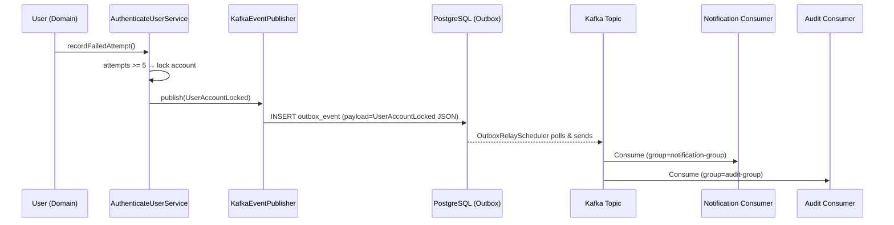

# UserAccountLocked

Published when a user account is locked after 5 failed login attempts.

## Schema

| Field | Type | Description |
|-------|------|-------------|
| `userId` | UUID | Locked user's ID |
| `email` | String | User's email |
| `failedAttempts` | int | Total failed attempts |
| `lockedUntil` | Instant | Lock expiry |
| `timestamp` | Instant | Event time |

## Details

- **Producer**: [[01 - Services/Identity Service\|Identity Service]] via [[04 - Ports/outbound/EventPublisher\|EventPublisher]]
- **Topic**: `aegis.identity.user-account-locked` ([[05 - Infrastructure/Kafka Topics\|Kafka Topics]])
- **Schema**: `specs/002-user-authentication/contracts/user-account-locked-event.json`
- **Trigger**: `User.recordFailedAttempt()` when attempts reach 5

## Consumers

- Notification service (future) — send alert email
- Audit service (future)
