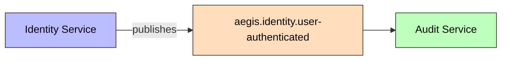
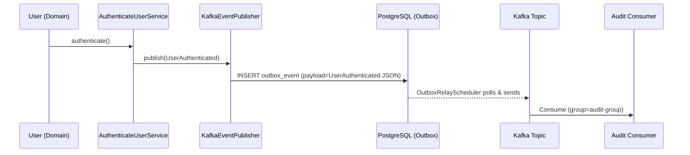

# UserAuthenticated

Published on successful user login.

## Schema

| Field | Type | Description |
|-------|------|-------------|
| `userId` | UUID | Authenticated user's ID |
| `email` | String | User's email |
| `timestamp` | Instant | Event time |
| `ipAddress` | String | Request origin IP |

## Details

- **Producer**: [[01 - Services/Identity Service\|Identity Service]] via [[04 - Ports/outbound/EventPublisher\|EventPublisher]]
- **Topic**: `aegis.identity.user-authenticated` ([[05 - Infrastructure/Kafka Topics\|Kafka Topics]])
- **Schema**: `specs/002-user-authentication/contracts/user-authenticated-event.json`
- **Trigger**: `User.authenticate()` success

## Consumers

- Audit service (future)
