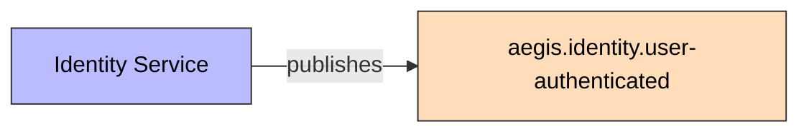
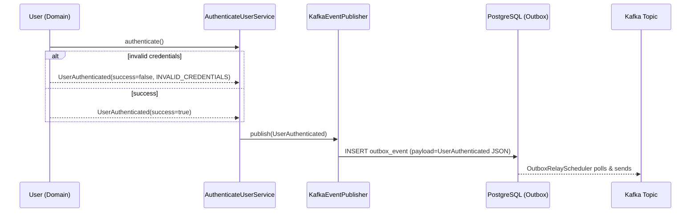

# UserAuthenticated

Published on every login attempt — both success and failure — with a `success` flag.

## Schema

| Field | Type | Description |
|-------|------|-------------|
| `eventId` | UUID | Unique event identifier |
| `eventType` | String | `USER_AUTHENTICATED` |
| `schemaVersion` | String | `1.0` |
| `userId` | UUID | Authenticating user's ID |
| `email` | String | User's email |
| `timestamp` | Instant | Event time |
| `success` | boolean | Whether authentication succeeded |
| `failureReason` | String | Failure reason (e.g., `INVALID_CREDENTIALS`) or `null` |
| `correlationId` | String | Correlation ID for tracing |

## Details

- **Producer**: [[01 - Services/Identity Service|Identity Service]] via [[04 - Ports/outbound/EventPublisher|EventPublisher]]
- **Topic**: `aegis.identity.user-authenticated` ([[05 - Infrastructure/Kafka Topics|Kafka Topics]])
- **Trigger**: `User.authenticate()` in [[02 - Domain Models/User|User]] aggregate (emitted on success and failure)

## Consumers

- Ninguno actualmente (sin consumidor configurado)
