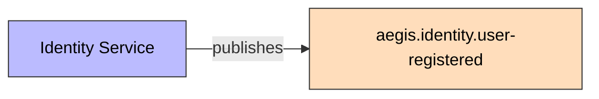
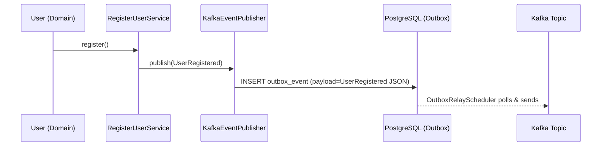

# UserRegistered

Published when a new user successfully registers.

## Schema

| Field | Type | Description |
|-------|------|-------------|
| `eventId` | UUID | Unique event identifier |
| `eventType` | String | `USER_REGISTERED` |
| `schemaVersion` | String | `1.0` |
| `userId` | UUID | New user's ID |
| `email` | String | User's email |
| `firstName` | String | User's first name |
| `lastName` | String | User's last name |
| `registeredAt` | Instant | Registration time |
| `correlationId` | String | Correlation ID for tracing |

## Details

- **Producer**: [[01 - Services/Identity Service|Identity Service]] via [[04 - Ports/outbound/EventPublisher|EventPublisher]]
- **Topic**: `aegis.identity.user-registered` ([[05 - Infrastructure/Kafka Topics|Kafka Topics]])
- **Trigger**: `User.register()` in [[02 - Domain Models/User|User]] aggregate

## Consumers

- Ninguno actualmente (sin consumidor configurado)
