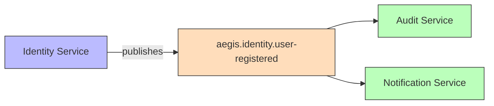
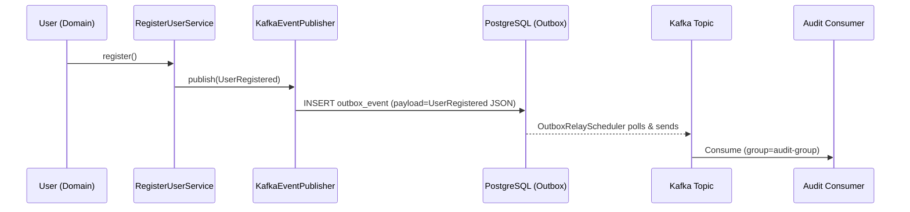

# UserRegistered

Published when a new user successfully registers.

## Schema

| Field | Type | Description |
|-------|------|-------------|
| `userId` | UUID | New user's ID |
| `email` | String | User's email |
| `status` | String | Initial status |
| `timestamp` | Instant | Event time |

## Details

- **Producer**: [[01 - Services/Identity Service\|Identity Service]] via [[04 - Ports/outbound/EventPublisher\|EventPublisher]]
- **Topic**: `aegis.identity.user-registered` ([[05 - Infrastructure/Kafka Topics\|Kafka Topics]])
- **Schema**: `specs/001-user-registration/contracts/user-registered-event.json`
- **Trigger**: `User.register()` in [[02 - Domain Models/User\|User]] aggregate

## Consumers

- Audit service (future)
- Notification service (future)
