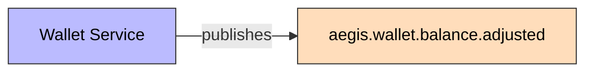
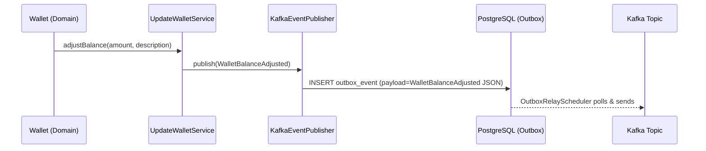

# WalletBalanceAdjusted

Published when a wallet's balance is adjusted (deposit or withdrawal) via the balance adjustment endpoint.

## Schema

| Field | Type | Description |
|-------|------|-------------|
| `eventId` | UUID | Unique event identifier |
| `eventType` | String | `WALLET_BALANCE_ADJUSTED` |
| `schemaVersion` | String | `1.0` |
| `walletId` | UUID | Target wallet's ID |
| `userId` | UUID | Owner's ID |
| `previousBalance` | BigDecimal | Wallet balance before adjustment |
| `newBalance` | BigDecimal | Wallet balance after adjustment |
| `amount` | BigDecimal | Adjusted amount (positive for deposit, negative for withdrawal) |
| `currency` | String | ISO 4217 currency |
| `description` | String | Human-readable description of the adjustment |
| `timestamp` | Instant | Event time |
| `correlationId` | String | Correlation ID for tracing |

## Details

- **Producer**: [[01 - Services/Wallet Service|Wallet Service]] via [[04 - Ports/outbound/EventPublisher|EventPublisher]]
- **Topic**: `aegis.wallet.balance.adjusted` ([[05 - Infrastructure/Kafka Topics|Kafka Topics]])
- **Trigger**: `PATCH /api/v1/wallets/{id}/balance`
- **Source**: `backend/aegis-wallet-service/src/main/java/com/aegis/wallet/domain/event/WalletBalanceAdjusted.java`

## Consumers

- Ninguno actualmente (sin consumidor configurado)
