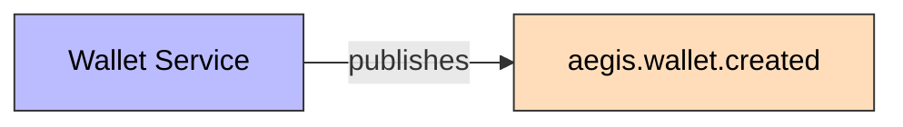
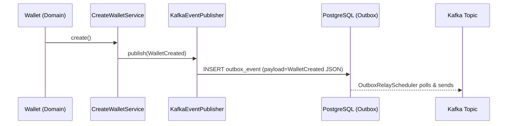

# WalletCreated

Published when a new wallet is created.

## Schema

| Field | Type | Description |
|-------|------|-------------|
| `eventId` | UUID | Unique event identifier |
| `eventType` | String | `WALLET_CREATED` |
| `schemaVersion` | String | `1.0` |
| `walletId` | UUID | New wallet's ID |
| `userId` | UUID | Owner's ID |
| `currency` | String | ISO 4217 currency |
| `timestamp` | Instant | Event time |
| `correlationId` | String | Correlation ID for tracing |

## Details

- **Producer**: [[01 - Services/Wallet Service|Wallet Service]] via [[04 - Ports/outbound/EventPublisher|EventPublisher]]
- **Topic**: `aegis.wallet.created` ([[05 - Infrastructure/Kafka Topics|Kafka Topics]])
- **Trigger**: `Wallet.create()` factory method

## Consumers

- Ninguno actualmente (sin consumidor configurado)
