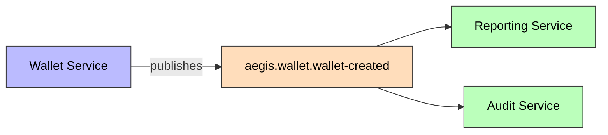
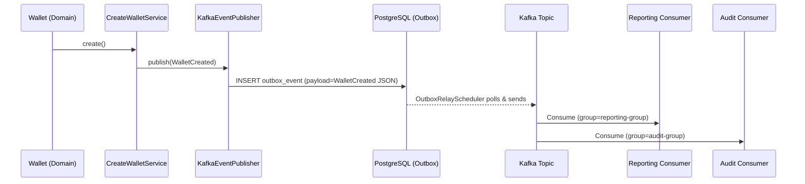

# WalletCreated

Published when a new wallet is created.

## Schema

| Field | Type | Description |
|-------|------|-------------|
| `walletId` | UUID | New wallet's ID |
| `userId` | UUID | Owner's ID |
| `currency` | String | ISO 4217 currency |
| `balance` | BigDecimal | Initial balance (0) |
| `timestamp` | Instant | Event time |

## Details

- **Producer**: [[01 - Services/Wallet Service\|Wallet Service]] via [[04 - Ports/outbound/EventPublisher\|EventPublisher]]
- **Topic**: `aegis.wallet.wallet-created` ([[05 - Infrastructure/Kafka Topics\|Kafka Topics]])
- **Schema**: `specs/003-create-wallet/contracts/events/wallet-created-event.json`
- **Trigger**: `Wallet.create()` factory method
