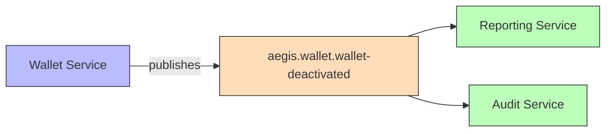
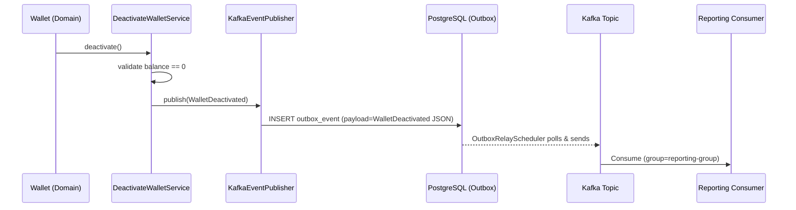

> **Status: Planned** — This event is documented but not yet implemented in code. The wallet deactivation flow exists but does not yet publish a domain event.

# WalletDeactivated

Published when a wallet is successfully deactivated (closed).

## Schema

| Field | Type | Description |
|-------|------|-------------|
| `walletId` | UUID | Wallet's ID |
| `userId` | UUID | Owner's ID |
| `previousStatus` | String | Status before deactivation |
| `timestamp` | Instant | Event time |

## Details

- **Producer**: [[01 - Services/Wallet Service\|Wallet Service]] via [[04 - Ports/outbound/EventPublisher\|EventPublisher]]
- **Topic**: `aegis.wallet.wallet-deactivated` ([[05 - Infrastructure/Kafka Topics\|Kafka Topics]])
- **Trigger**: `Wallet.deactivate()` (after business rule validation)
